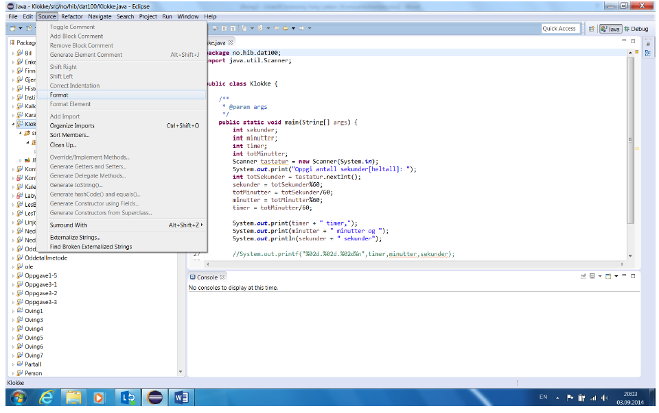

### Ordne formattering og rydding av koden

Format (layout) av kode - eksempelvis bruk av innrykk og linjeskift - har betydning for lesbarhet av
programmet (koden).

Når du skriver kode, vil Eclipse veilede deg til å lage vel-formatert kode. Videre kan Eclipse rydde opp i koden
og hvis du roter til koden, kan Eclipse automatisk formatere koden til standard Java-regler. Dette kan velges
fra menyen Source > Format (se skjermbildet under). Valget er også tilgjengelig i menyen du får ved å høyreklikke
i kode-editor vinduet. Det er også en tastekombinasjon som kan være grei å huske for dette. Den er
Ctrl + Shift + F.

En annen tastekombinasjon som kan nevnes i denne sammenhengen er Ctrl + Shift + O som automatisk
organiserer import-setningene for deg.

Fra menyen som kommer etter et høyre-klikk på musen i kode-editor vinduet, har du også et valg som heter
Source > Clean Up… . Velger du dette for prosjektet, vil Eclipse formatere kode, organisere import og gjøre
en del annen opprydding for all kode i prosjektet. All opprydding kan konfigureres til minste detalj, men det
kommer vi tilbake til i senere kurs.

