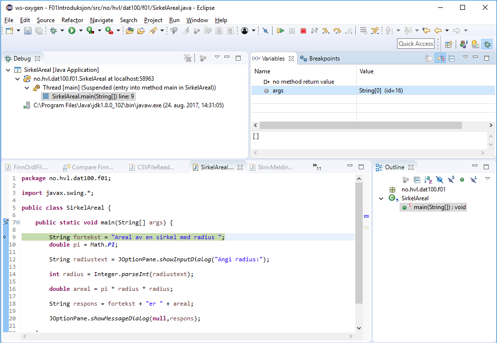

# Debugging i Eclipse

Som beskrevet i læreboken innebærer «Debugging» - eller feilfjerning – å kjøre et program steg for steg for å finne og fjerne feil. Utviklingsverktøy som Eclipse støtter dette og gjør det mulig bla. å inspisere tilstanden av programmet dvs. verdier av variable underveis.

I tillegg til feilfinning og feilfjerning kan stegvis utførsel også være nyttig for å forstå hvordan de ulike konstruksjoner i Java fungerer (semantikken).

```java

public class SirkelAreal {

  public static void main(String[] args) {

      String fortekst = "Areal av en sirkel med radius ";

      double pi = Math.PI;

      String radiustext = JOptionPane.showInputDialog("Angi radius:");

      int radius = Integer.parseInt(radiustext);
      double areal = pi * radius * radius;

      String respons = fortekst + "er " + areal;

      JOptionPane.showMessageDialog(null,respons);
    }
}

```

Legg koden ovenfor inn i et Eclipse prosjekt.

For å kjøre programmet stegvis bruker vi «Run» etterfulgt av «Debug» i Eclipse. Om vi ikke har satt noen pausepunkter (breakpoints) da vil Eclipse bare kjøre programmet som vanlig.
1. For å sette et pausepunkt kan vi høyreklikke på linjenummeret der vi ønsker å sette et pause-punkt. Sett et breakpoint (toggle breakpoint) i linjen der main-metoden begynner. Eclipse indike-rer et breakpoint med en blå sirkel.
2. Velg nå Run etterfulgt av «Debug» og svar ja til å skifte perspektiv. Programmet er midlertidig stanset ved begynnelsen av main-metoden (indikert med grønn) og øverste til høyre har vi et vindu der man kan se den aktuelle verdi av variablene i programmet (se figuren nedenfor).




4. Bruk nå «Run» etterfulgt av «Step Over» til å gå stegvis frem i programmet og se på hvordan ver-dien av variablene endres underveis. Vær oppmerksom på at på noen PCer kan dialog boksen gjemme seg bak andre vinduer.
5. Eksperimenter med bruk av «Run» etterfulgt av «Resume» og prøv å sette flere pausepunkter i programmet. Hva skjer? - og hvorfor?
6. Når du er ferdig med debugging kan du vende tilbake til det vanlige Java perspektivet (organise-ring av vinduer) i Eclipse ved å velge «Window», «Perspective», «Open Perspective» og «Java».
7. Et breakpoint kan fjernes ved å høyreklikke på linjen og velge «Toggle breakpoint». Det er også mulig å slå fra (deaktivere) et breakpoint ved å velge «Disable breakpoint» og det kan da slås på (aktiveres) igjen ved å velge «Enable breakpoint».
