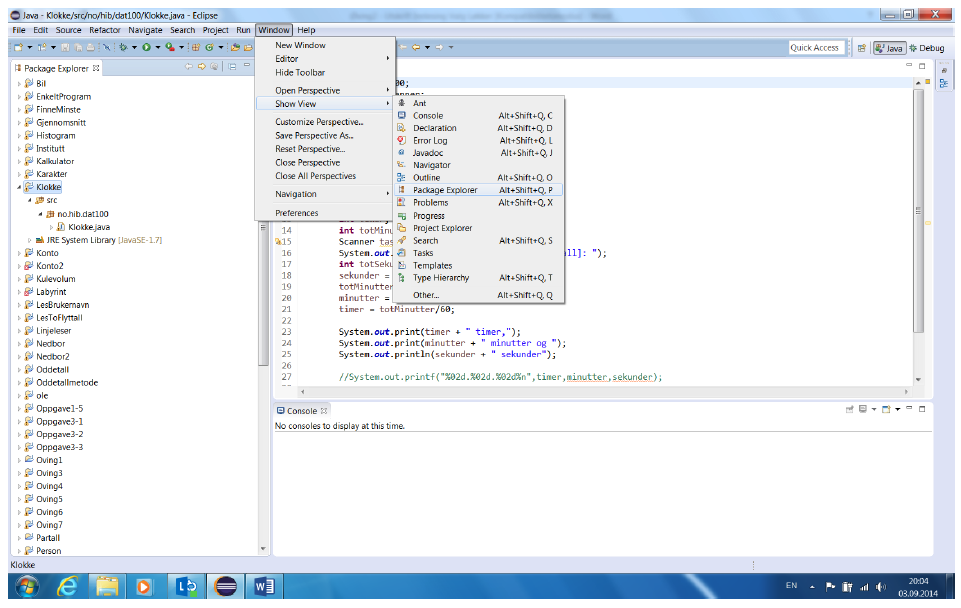

### Perspektiver og organisering av vinduer

Eclipse bruker begrepet perspektiver (engelsk: Perspectives) som en måte å organisere de vinduer og den
funksjonalitet som er synlig i programmet. Perspektiver representerer ulike måter Eclipse vil oppføre seg på
og et perspektiv vil endre menyer, knapperader og vindu slik at de passer til de oppgavene som er ment å
bli utført. Inntil videre har de fleste kun brukt det som kalles Java-perspektivet. Vi har tidligere brukt et
annet perspektiv – Debug-perspektivet.

Av og til lukker vi vindu ved et uhell. Alle vinduene kan vises igjen bed å bruke menyen Windows > Show
View > … (se skjermbildet under).

Legg merke til at alle vinduene kan plasseres rundt om på ulike steder ved å dra dem med musen. Visningen
til Eclipse har et hovedvindu med et arbeidsområde som i Java-perspektivet er kode-editoren, med mulighet
for å legge andre vindu på venstre side, høyre side og under. Normalt sett er det lite lurt å endre standardplassering.

Man kan gjenskape alle vinduer for et perspektiv via Window > Reset Perspectiv > … og man kan
få frem et bestemt perspektiv via Window > Open Perspective eller bruke perspektiv knappe-raden øverst
til høyre som inneholder knapper for de siste perspektivene du har valgt.

