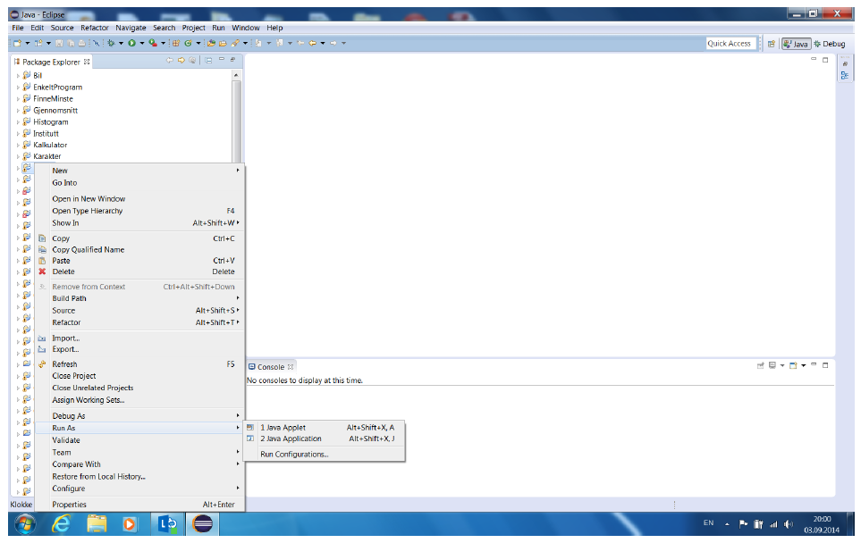

### Kjøre et prosjekt

Etterhvert får dere en del prosjekt i Package Explorer vinduet. Hvis du trykker på Run-knappen i
knapperaden, vil Eclipse starte om igjen det forrige programmet du kjørte. Den enkleste måten å sikre at du
starter det programmet du ønsker, er å høyre-klikke på klassen med main-metode og velge Run As > Java
Application. Høyre-klikker du på prosjektet, kommer det et valg hvor du kan velge mellom alle mainmetodene
i prosjektet (hvis der er flere klasser med main-metode). Hvis det bare er en klasse med mainmetode,
er det denne som blir startet (se skjermbildet under).

