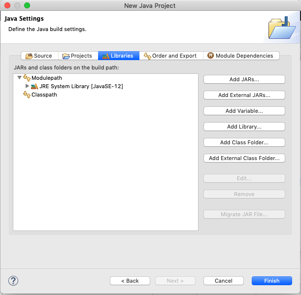

## EasyGraphics

EasyGraphics er et bibliotek som vi skal bruke ifm. en del programmeringsoppgaver. Som del av første Java programmeringslab ble det vist hvordan easygraphics biblioteket importeres og brukes i egne Eclipse-prosjekt.

- Dokumentasjon: https://dbsys.info/programmering/easygraphics/javadoc/index.html

I oppgave 5 på første programmeringslab:

https://github.com/dat100hib/dat100public/blob/master/programmering/jplab1-onsdag/JP1.md

ble det vist hvordan man setter opp bruk av EasyGraphics i egne prosjekt ved å inkludere jar-filen for biblioteket.

Det er også mulig kun å referere til jar-filen fra Eclipse-prosjektet uten å inkludere det via import.

Dette kan gjøres slik:

1. Finn ut hvor filen `easygraphics.jar`-filen som inneholder implementasjonen av EasyGraphics biblioteket er lagret på PC’en din. Den legger i `dat100public/easygraphics/lib` mappen

2. Når du oppretter et nytt prosjekt, trykk «Next» i første dialogboks etter du har skrevet inn navn og velg *Libraries*. Da vil du få følgende dialog:

    

3. Velg *Classpath* etterfulgt av *Add External JARs…*

4. Nagiver til filen `easygraphics.jar` og velg «Åpne»

For å bruke EasyGraphics i en klasse i prosjektet ditt, må du skrive:

```java
import easygraphics.*;
```
starten av filen for klassen.

I stedet for `.*`, kan du også skrive klassen/klassene du har behov for. Dersom du da trenger flere klasser, må du ha flere import-setninger, for eksempel: import easygraphics.EasyGraphics. Det er også mulig å taste `CTRL + Shift + o` i Eclipse. Da vil Eclipse automatisk tilføye nødvendige import-setninger.

Dersom du skulle glemme å legge til EasyGraphics biblioteket til prosjektet når du oppretter det, kan det også lett gjøres i etterkant. Da høyreklikker du på prosjektet (i Package Explorer) og velger *Properties* (nederst). Du velger *Java Build Path*.

Da får du opp en dialog som ligner dialogen ovenfor. Deretter gjør du punktene 3. og 4. ovenfor.
