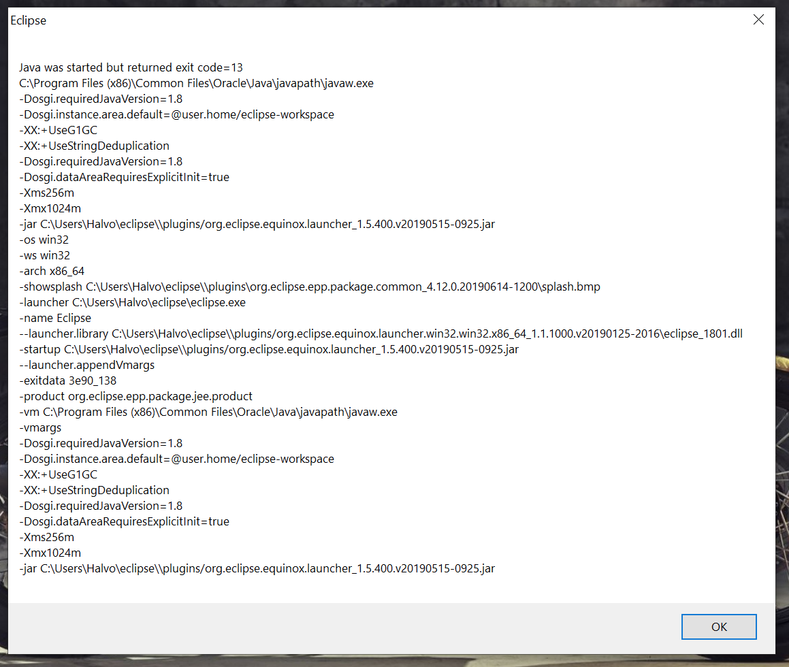

## Eclipse

Eclipse er et integrert utviklingsmiljø (Integrated Development Environment) som gjør det enklere å skrive, kjøre og utføre feilfinning i Java programmer.

### Nedlasting

Eclipse IDE for Java Developers lastes ned via:

https://www.eclipse.org/downloads/packages/release/2021-06/r/eclipse-ide-java-developers

Last ned filen under *Download Links* for rett operativsystem.

### Installasjon av Eclipse IDE

**Husk:** det er viktig at JDK er installert først

1.	Pakk ut den filen som inneholder Eclipse (zip,dmg,tar.gz)
   - **Windows** Om du lastet ned en .exe-fil da kan du dobbelklikke på denne for installasjon. Om du lastet ned en .zip-fil må du flytte zip-filen til den mappen der du ønsker å installere Eclipse. Høyre-klikk på .zip filen og velg *Pakk ut alle …*
   - **MacOS** Dobbel-klikk på .dmg filen og etter dette på Eclipse Installer og velg mappene der du ønsker å instyallere. Standard valg fungerer vanligvis bra.
   - **Linux** Flyt .tar.gz filen til den mappen der du ønsker å installere Eclipse. Pakk ut tar.gz filen ved bruk av `tar`-kommandoen.
2.	Nå kan man starte Eclipse ved å åpne mappen du valgte for å pakke ut filene. Der finner du en programfil som heter `eclipse`. Start denne ved å dobbelklikke.
3.	Når du får spørsmål om workspace, oppretter du et workspace som heter DAT100 (det er praktisk med ett workspace pr. fag og det er mulig å opprette flere workspaces senere).

### Problem med å starte Eclipse

På noen Windows-plattformer kan det forekomme at en versjon av java’s virtuelle maskin (JVM) er installert som forhindrer Eclipse i å starte. Feilmeldingen ser ut lignende bildet nedenfor



Da må man endre i oppstarts-filen eclipse.ini som finnes i eclipse-mappen ved å tilføye:

```
-vm C:/Program Files/Java/jdk16.0.2/bin/javaw.exe
```

før linjen som begynner med –vmargs.

Se [eclipse.ini](https://github.com/dat100hib/dat100public/blob/master/eclipse/eclipse.ini) som eksempel der rettelsen er gjort.

**Husk** å endre i linjen ovenfor om man har valgt å installere JDK i en annen folder eller har installert en annen versjon av JDK.

https://www.youtube.com/watch?v=sWSySXfR17c
