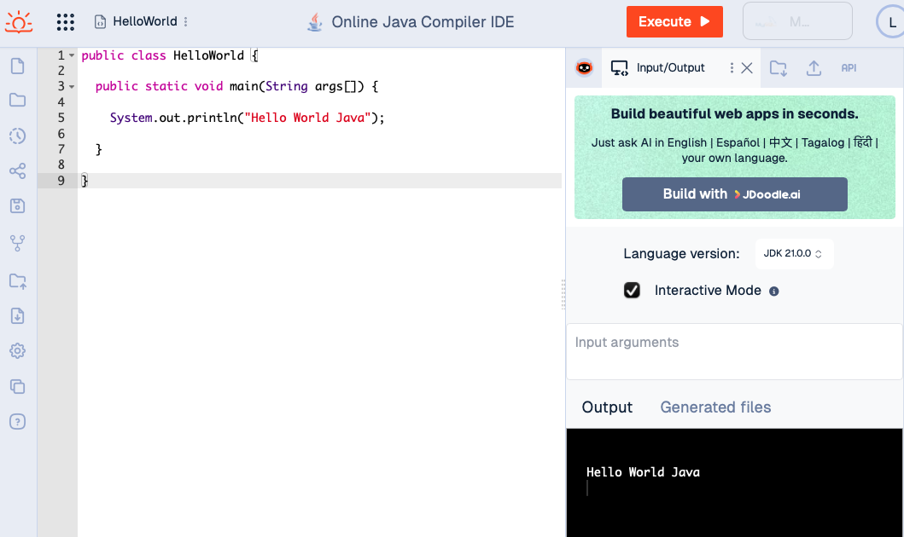

# DAT100: Java Programmering 0 - uke 33

I de første ukene av emnet skal vi bruke det web-baserte utviklingsmiljø JDoodle: https://www.jdoodle.com/ for å komme igang med Java programmering. Senere skal vi skifte til *IntelliJ* som er mer avansert utviklingmiljø for Java programmering.

Formålet med oppgavene på denne første programmeringslab'en er å sikre at du:

1. har en brukerkonto slik du har tilgang til JDoodle
2. kan skrive Java-kode i JDoodle og få programmene til å kjøre
3. vet hvor du kan finne eksempelkoden som brukes i undervisningen 
4. blir litt kjent med JDoodle utviklingsmiljøet 

Det er **veldig viktig** at alle får dette til - så om du har problemer med å få dette til ta kontakt med undervisere eller lab-assistenter for raskt å få hjelp.

Oppgave 2 nedenfor utgjør første obligatoriske innlevering i faget der du skal demonstrere at du har fått Java programmet til å fungere. Det gjør du ved å laste opp et skjerm-bilde på Canvas som innlevering. For **Deadline/Frist** se oppgaven i Canvas.

### Oppgave 1: Opprette en brukerkonto på JDoodle

Gå inn på JDoodle: https://www.jdoodle.com og trykk på knappen `Login`.

Velg `Sign Up` for å opprette en brukerkonto. Som epost-adresse kan du velge en epost-adresse du har fra tidligere - eller din HVL student epost-addresse. 

Du kan også velge å logge inn på JDoodle ved å bruke eks. en eksisterende Google eller Microsoft konto. 

### Oppgave 2: Første Java Program i JDoodle

I denne oppgaven skal du opprette et første Java prosjekt i JDoodle, skrive og kjøre et enkelt Java program.

1. Log-in på JDoodle (om du ikke alledere er logget in)
2. Velg `Start Coding` under `JDoodle.com` 
3. Under `Pick a language/framework` velg `Java` (ved å skrive *Java* i dialog-boksen - JDoodle kan brukes til andre programmeringsspråk enn Java)
4. Under `Project name` skriv inn `HelloWorld`, velg `Empty Project` og `Start Coding`
5. Kopier og lim inn (Copy + Paste) koden nedenfor i koderedigerings-vinduet 

```java
public class HelloWorld {
    
  public static void main(String args[]) {
    
    System.out.println("Hello World Java");
    
  }
  
}
```

6. Trykk på `Execute`-knappen for å kjøre programmet. Etterfølgende skal vinduet i nettleseren se ut som nedenfor, der programmet har skrevet ut noe tekst i `Output`-vinduet.

 

7. Modifiser programmet slik det skriver ut en linje med 10 stjerner (`*`) før og etter teksten `Hello World Java`.
8. Kjør programmet fra punkt 7. Når programmet fungerer, lag et skjerm-bilde tilsvarende bildet ovenfor. Skjerm-bildet skal leveres inn i Canvas som svar på oppgaven.

### Oppgave 3: Syntaks for Java programmer

Syntaksen for et programmeringsspråk er de regler som bestemmer hvilke ord og skilletegn som er lov å bruke og hvordan de kan settes sammen til setninger og større enheter i et program. 

Nedenfor er en liste a)-f) med eksempel kode som alle inneholder syntaks-feil dvs. programmene er ikke lovlige Java-programmer. 

For hvert program i a)-f) nedenfor gjør følgende:

1. Legg koden inn i JDoodle (enklest å gjøre dette ved å bruke Copy+Paste)
2. Prøv å kjøre programmet ved å bruke `Execute` - og se hvilken feil-melding som kommer.
3. Forsøk å forstå feil-meldingen og hva som er problemet. Bruk evt. `Debug with JDroid` for å få hjelp.
4. Rett programmet slik det blir et lovlig Java-program dvs. programmet kan utføres uten feilmelinger. 

#### a)
```java
public class Debug {
    
  public static void main(String args[]) {
      
    int x = 10;
    int y = 25;
    
    int z = x + y;

    System.out.println("Sum of x + y = " + z)
    
  }
}
```

#### b)

```java
public class Debug {
    
  public static void main(String args[]) {
      
    int x = 10;
    int y = 25;
    
    int z = x + y;

    System.outprintln("Sum of x + y = " + z);
    
  }
}
```

#### c)

```java
public class Debug {
    
  public static void main(String args[]) {
      
    int x = 10;
    y = 25;
    
    int z = x + y;

    System.out.println("Sum of x + y = " + z);
    
  }
}
```

#### d)

```java
public class Debug {
    
  public static void main(String args[]) {
      
    int x = 10;
    int y = 25;
    
    int z = x + y;

    System.out.println("Sum of x + y = " + z);
    
  }
```

#### e)

```java
public Debug {
    
  public static void main(String args[]) {
      
    int x = 10;
    int y = 25;
    
    int z = x + y;

    System.out.println("Sum of x + y = " + z);
    
  }
}
```

#### f)

```java
public class Debug {
    
  public static void main(String args[]) {
      
    int x = 10;
    int y = 25;
    
    int z = x + y;

    System.out.println("Sum of x + y =  + z);
    
  }
}
```

### Oppgave 4: GitHub og kodeeksempler fra forelesninger

I faget bruker vi sky-tjenesten GitHub for å legge ut eksempler fra forelesninger, oppgaver og kode for de ukentlige Java programmeringslab, samt obligatoriske prosjekt og innleveringer.

Hovedsiden for DAT100 GitHub oppbevaringsplassen finnes her

- https://github.com/dat100hib/dat100public/

Eksempler fra undervisningen finnes her

- https://github.com/dat100hib/dat100public/tree/master/undervisning

og har en mappe for hver forelesning.

Oppgaver for programmeringslab finnes her

- https://github.com/dat100hib/dat100public/tree/master/programmering

med en mappe for hvert programmeringslab.

Eksempler og oppgaver oppdateres etterhvert i emnet.

1. Gå inn på eksempelkoden fra første forelesning: https://github.com/dat100hib/dat100public/tree/master/undervisning/U01Introduksjon Koden er beskrevet på side 2-5 i Java-boken og illustrerer hvordan brukeren kan gi input til et Java-program og hvordan et Java-program kan lese fra en fil.

2. Opprett et tomt `Multi-file` prosjekt i JDoodle

3. Legg inn filene `FinnOrdIFil.java` og `handeliste.txt` i JDoodle prosjektet

4. Kjør programmet og gi input slik det finner et søkeord i handlelisten.

### Oppgave 5: Eksperimenter for å bli litt mer kjent med JDoodle 

Log-in i JDoodle og eksperimenter for å finne svar på følgende:

1. Hvordan får du frem listen av prosjektene dine - og hvordan skifter du fra å jobbe med et prosjekt til et annet prosjekt.

2. Hvordan oppretter du et nytt prosjekt?

3. Når du er inne på et prosjekt - finn ut hva de ulike verktøy på venstre siden kan brukes til.

4. Hvordan kan du endre navn på et prosjekt?

5. Hvordan kan du endre navn på en fil i et *multi-fil* prosjekt?

6. Hvis du stenger vinduet til høyre i JDoodle hvordan får du `JDroid` og `Input/Output` frem igjen?
