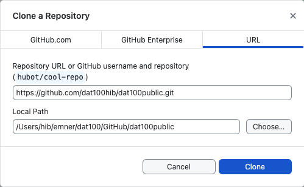
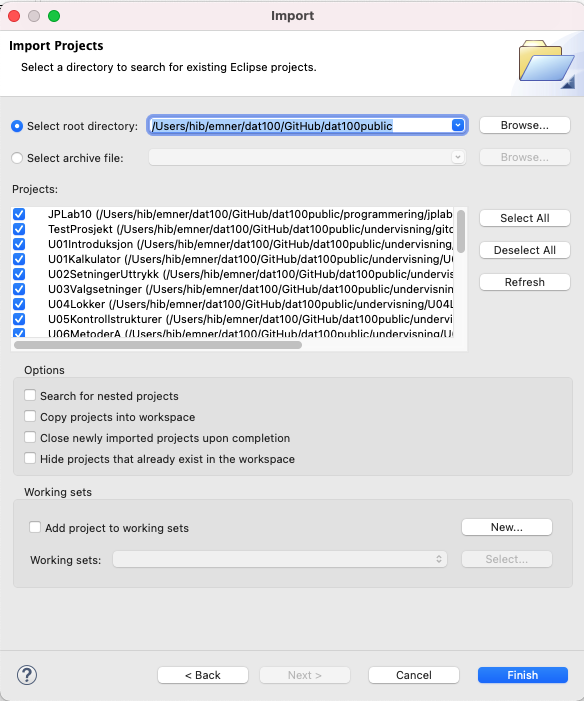

# DAT100: Java Programmering 0 - uke 33 og 34

## Java programmering og utviklingsmiljø

Formålet med denne programmeringslab/øving er å sikre at du har en fungerende installasjon av Java Development Kit (JDK) og Eclipse på egen PC.

- [x] Oppgave 2,4 og 5 utgjør første obligatoriske innlevering der du må demonstrere at du har fått Java programmene til å fungere.

**Deadline/Frist**: se Canvas for faget

På Canvas skal du laste opp skjermbilder i oppgaven *Demonstrere kjørende Java programmer* på Canvas som viser: 

1. Eclipse-vindue etter programmet er kjørt (oppgave 2)
2. Eclipse-vindue etter at enhetstester er kjørt (oppgave 4)
3. Programkode og easygraphics vindu etter program er kjørt (oppgave 5)

Det er veldig viktig at alle får dette til - så om du har problemer med dette så ta kontakt med undervisere eller labassistenter for å få hjelp.

Les de enkelte oppgaver nedenfor igjennom før du begynner.

### Oppgave 1: Nedlasting og installasjon av JDK, Eclipse IDE og Git

Følg installasjonsveiledningene som finnes nederst på siden

https://github.com/dat100hib/dat100public/blob/master/README.md

og installer JDK, Eclipse og GitHub Desktop ved å gå igjennom de stegene som er beskrevet i veiledninge som er lenket til nederst.

### Oppgave 2: Første JAVA Eclipse-prosjekt

I denne oppgaven skal du opprette et programmeringsprosjekt i Eclipse, skrive og kjøre et enkelt Java program.

1.	Start Eclipse
2.	Velg *File | New | Java Project* og skriv inn `Velkommen` som prosjektnavn.
3. 	Under *Module* fjern tick i *Create module-info.java* siden vi ikke i dette programmet skal bruke modulsystemet i Java
4.  Trykk *Finish*
5.  Åpne *Velkommen* i *Package Explorer* og velg *src*
5.	Velg *File | New | Class* og skriv inn `no.hvl.dat100` som pakkenavn og `Velkommen` som klassenavn. Kryss av for å generere `public static void main` automatisk. Trykk *Finish*

    Skriv inn:

```java
System.out.println("Nå virker det!");
```

så at hele filen ser slik ut:

```java
package no.hvl.dat100;

public class Velkommen {
    public static void main(String[] args){
    	System.out.println("Nå virker det!");
    }
}
```

4.	Velg *Run | Run* for å utføre programmet.
5.	Du vil nå få utskriften i konsoll-vinduet (nederst i Eclipse vinduet).
6.	Modifiser programmet slik det skriver ut en linje med 10 stjerner (`*`) før og etter selve teksten.

### Oppgave 3: Sjekke ut kode fra github

Vi skal bruke https://www.github.com til å distribuere kodeeksempler fra forelesninger og startkode for programmeringsoppgaver. Til dette formålet er der opprettet en oppbevaringsplass (repository) med navnet `dat100public` på github som vil inneholde Eclipse-prosjekter for eksemplene.

#### 3a - Videoer om Git og GitHub Desktop

Før du gjør denne oppgaven bør du se igjennom videoene om Git (Deling og samarbeid om koding) samt GitHub (Clone og Import) som ligger på Canvas i modulet for den første uken.

Følg veiledningen for å opprette en brukerkonto på github og installasjon av GitHub Desktop applikajonen:

https://github.com/dat100hib/dat100public/blob/master/installasjon/git.md

#### 3b - Opprette lokal kopi av oppbevaringsplassen

Du skal først opprette (clone) en lokal kopi på din egen PC av `dat100public` oppbevaringsplasen.

1. Start GitHub Desktop applikasjonen
2. Velg *File | Clone Repository*
3. I diaglog-boksen velger du *URL* (se nedenfor) 
4. Limer inn https://github.com/dat100hib/dat100public.git i feltet *Repository URL* 
5. Velge via *Choose* en lokal plass på PC'en der du ønsker å lagre oppbevaringsplassen. Her er det **VIKTIG** at den mappen du velger **ikke** er en mappe som ligger under en sky-tjeneste (eks. en Dropbox- eller OneDrive mappe) da dete vil gi problemer med Git og Eclipse.
6. Til slutt trykker du på *Clone*
7. Sjekk å filene er korrekt lastet ned ved å valge *View the files...*



Neste steg er å importere prosjektene inn i Eclipse IDE.

1. Start Eclipse IDE.

2. Velg *File | Import… | General | Existing Projects into Workspace* og trykk på *Next*

3. Bruk *Browse* til å navigere ned der du lagret mappen *dat100public* i forrige steg dvs. den den lokale kopi av oppbevaringsplassen.

4. Under *Projects* skal du nå se en lang rekke Eclipse prosjekt med eksempelkode (se nedenfor). 

5. Trykk *Finish* for å importere prosjektene inn i Eclipse. 

 

#### 3c - Tilgang til nye og oppdaterte prosjekt 

Etterhvert i faget oppdaterer vi eksempelprosjektene og du får også bruk for å få tilgang til eksempler for de neste forelesninger. For å få tilgang til de må du oppdatere den lokale oppbevaringsplassen på PC’en din:

1. Start GitHub Desktop og sjekk at `dat100public` er valgt som *Current Repository* (se nedenfor)

2. Trykk på *Fetch origin* etterfulgt av *Pull origin* da vil den lokale kopi av oppbevaringsplassen bli oppdatert.

3. Endringer i i filer som allerede er importert inn i Eclipse vil umiddelbart være synlige. Eventuelle nye prosjekt må importeres inn i Eclipse som beskrevet i steg 3-5 i punker 3b ovenfor.


### Oppgave 4: Enhetstesting og JUnit

For noen programmeringsoppgaver skal vi bruke [JUnit](https://junit.org/junit5/) til å teste java-koden som dere skriver. Formålet med denne oppgaven er å bli kjent med JUnit.

**Før** du går videre med denne oppgaven bør du se igjennom videoen om JUnit som er tilgjengelig på Canvas siden for denne programmeringslab.

Eksempelkoden fra første forelesning du sjekket ut i oppgave 3 inneholder et Eclipse-prosjekt `U01Kalkulator` som implementerer en enkel kalkulator med enkelt brukergrensesnitt.

1.	Kjør applikasjonen ved å velge `Grensesnitt.java` etterfulgt av *Run | Run*
2.	Kjør JUnit enhetstestene i prosjektet ved å velge filen `TestKalkulator.java` etterfulgt av  *Run | Run As | JUnit Test*

Enhetstestene i punkt 2 ovenfor feiler fordi ikke alt er implementert i filen `Kalkulator.java`:

1.	Åpn filen `Kalkulator.java` i editoren ved å dobbel-klikke på den.
2.	Implementer metodene `add`, `sub`, `mul` og `div` som vist i videoen om JUnit.

Kjør enhets-testene igjen og prøv applikasjonen via grensesnittet. Sjekk at alt fungerer som ønsket.

### Oppgave 5: Bruk av EasyGraphics

I forbindelse med forelesninger og programmeringsoppgaver skal vi bruke biblioteket [EasyGraphics](https://github.com/dat100hib/dat100public/blob/master/installasjon/easygraphics.md) til å illustrere en del begreper innen programmering. Formålet med denne oppgaven er å vise hvordan man bruker easygraphics biblioteket i egne programmer.

For å kunne bruke easygraphics biblioteket i egen kode må Eclipse-prosjektet ha en referanse til en jar-fil som inneholder java-koden for biblioteket. Jar-filen `easygraphics.jar` finnes i mappen `easygraphics/lib` på PC'en din der du sjekket ut koden fra github i oppgave 3.

1.	Opprett et nytt Eclipse-prosjekt som i oppgave 2 med navnet *EasyGraphicsTest*. Det er **VIKTIG** at du svarer nei til å oprette module-info filen.

2. Lag en pakke `no.hvl.dat100` i prosjektet
3. Legg inn en ny Java-klasse *Grafikk* i pakken `no.hvl.dat100` med følgende innhold:

```java
package no.hvl.dat100;

import easygraphics.*;

public class Grafikk extends EasyGraphics {

	public static void main(String[] args) {
		launch(args);
	}

	public void run() {
		makeWindow("Grafikk", 350, 150);
		drawCircle(150, 70, 60);
	}
}
```

Koden ovenfor gir i første omgang en rekke feilmeldinger siden vi ikke har fortalt hvor easygraphics biblioteket finnes.

4. Høyreklikk på prosjektet *EasyGraphicsTest* og velg *Import ... | General | File System | Browse ...* og naviger til mappen `easygraphics/lib` der `easygraphics.jar` filen legger. Velg `lib`og `easygraphics.jar` filen.

5.	Høyreklikk på prosjektet *EasyGraphicsTest* og velg *Properties | Java Build Path | Libraries | Classpath | Add JARs...*

6. Velg *EasyGraphicsTest*  og `easygraphics.jar` filen. Trykk *OK* og *Apply and Close*. Jar-filen er da lagt til prosjektet under *Referenced Libraries* og feilmeldinger skulle nå forsvinne.
7.	Kjør programmet og se at det gir forventet resultat.
8.	Modifiser programmet så det tegner to forskjellige sirkler på to ulike steder på skjermen.
9.	Skriv et program som tegner et åttetall (to sirkler).

### Oppgave 6: Jshell - Interaktivt Java verktøy

JShell er et interaktivt verktøy som er nyttig for å lære Java, men også for rask testing av mindre kodebiter. Gå igjennom siden:

https://dbsys.info/programmering/fagstoff/jshell.html

som viser hvordan en kommer i gang med å bruke jshell.

### Mer informasjon

For de som ønsker mer informasjon om Eclipse og Git:

-	Eclipse og Java: Velg  Help | Help Contents og Java development user guide
-	Bruk av Git i Eclipse: http://eclipsesource.com/blogs/tutorials/egit-tutorial/  
-	Git Reference: http://gitref.org/
