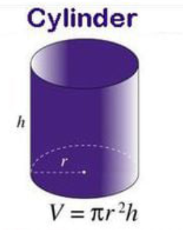

# DAT100: Java Programmering 1 - uke 34

Hovedformålet med de ukentlige programmeringslab'er/øvinger er:

1. å løse oppgaver som skal hjelpe til at du bedre forstår den teorien som vi går igjennom på forelesninger 
2. at du trener og blir god på praktisk Java programmering og bruken av utviklingsmiljø 

Programmeringslab'ene er derfor et veldig viktig element i faget.

Programmeringslab'ene inneholder fler oppgaver end de fleste vil klare å løse på de 2 timer som står i timeplanen. Det er derfor viktig at du forsøker å løse en god del av oppgavene før programmeringslab. Da kan du få hjelp på programmeringslab til de deler som du finner vanskelig. 

I alle oppgavene er det meningen at dere skal jobbe på egen hånd, men det er lov å diskutere og hjelpe hverandre, gjerne i grupper på 2-3 personer. Dette gir den beste læringseffekten og gjør det lettere å komme gjennom alle oppgavene. 

Det er kun noen av oppgavene på programmeringslab'ene som er obligatoriske og som skal leveres inn - og ikke alle programmeringslab inneholder obligatorisk oppgaver. Oppgaver som skal leveres inn vil være klart markert og skal leveres inn via Canvas. Der er ingen oppgaver på denne programmeringslab som skal leveres inn.

## Gjennomføring

Oppgavene nedenfor er oppdelt i tre kategorier

- **Grunnleggende oppgaver (G oppgaver):** som har til formål å sjekke at dere har forstått de fundamentale elementer og begrep innen Java programmering som gjennomgått så langt på forelesning og beskrevet i Java-boken.

- **Basis oppgaver (B oppgaver):** som har middels vanskelighetsgrad. Klarer du å løse disse oppgavene da indikerer det at du er godt med i faget.

- **Valgfrie oppgaver (V oppgaver):** dette er mer krevende oppgaver for de som ønsker flere utfordringer. Har du løst basisoppgavene da bør du gjøre et forsøk på å løse de valgfrie oppgavene.

JDoodle skal brukes til å skrive Java kode.

Om du finner de grunnleggende- eller basisoppgavene vanskelig, så les Kap. 2 i Java-boken en gang til og se igjennom videoene og slides fra forelesninger. 

Husk å ta kontakt med undervisere eller lab-assistenter om du sitter fast med programmeringsoppgavene og trenger hjelp for å komme videre.  

## Grunnleggende oppgaver

Vi skal i første omgang lage enkle Java-programmer som bare inneholder en enkelt `main()`– metode som utfører det vi vil ha gjort. Vi skriver programmene ved bruk av JDoodle. Koden i oppgave G1-G4 nedenfor skrives inn i `main`-metoden for klassen for programmet. 

### Oppgave G0 - Opprett et multi-fil JDoodle prosjekt

 Opprett et nytt *multi-file* JDoodle prosjekt med navn, eksempelvis `DAT100Lab1` for denne programmeringslab. 
 
 Fordelen ved et multi-fil prosjekt er at du da kan legge til en ny fil i prosjektet etterhvert for hver oppgave som du løser, eks. `OppgaveG1.java` for oppgave G1, `OppgaveG2.java` for oppgave 2 og så videre. Da slipper du å opprette et nytt prosjekt for hver opppgave.
 
 Mal-koden for Oppgave G1 er gitt nedenfor. Koden for å løse oppgaven skrives inn ved `TODO`-kommentaren.

```java
public class OppgaveG1 {

	public static void main(String[] args) {
		
      // TODO: sett inn koden for oppgave her - i dette tilfelle Oppgave G1

	}
}
```

Husk å kjøre Java-programmene for å se om de virker etterhvert som du går frem.

For å skifte mellom hvilke fil som kjøres i et multi-fil prosjekt når du utfører *Execute* må du trykke på de tre `...` ved siden av filen og velge *Make it as a Start File* for at det er koden i denne filen som blir utført. En kan se hvilken fil som er start-fil i et prosjekt ved at det har et *Hus* icon ved siden av seg.

### Oppgave G1 - Variable og tilordninger

#### a)

Skriv inn *deklarasjon* av to variable `a` og `b` av typen `int` (heltall) i `main`-metoden.

#### b)

Legg til to tilordningssetninger etter deklarasjonen i a) som gir variablen `a` verdien `5` og `b` verdien `7`.

#### c)

Skriv ut verdien av variablene `a` og `b` på slutten av programmet ved å bruke `System.out.println`-metoden. Kjør programmet og se at verdiene `5` og `7` blir skrevet ut output-vinduet.

#### d)

Prøv å endre typen på variablen `a` fra `int` til `boolean`. Dette skal gi en feilmelding. Hvorfor?

### Oppgave G2 - Variable og uttrykk

#### a)

Opprett en ny fil i prosjektet med navn `OppgaveG2.java` og kopier over koden fra oppgave G1. Gjør `Oppgave2.java` til start fil i prosjektet.

#### b)

Modifiser programmet fra oppgave G1 ved å legge til en deklarasjon av en variabel `c`.

#### c)

Legg til en tilordningssetning som setter verdien for variablen `c` lik summen av verdiene tildelt til `a` og `b`. Skriv verdien av variablen `c` ut i slutten av programmet. Kjør programmet og se at der `12` blir skrevet ut.

#### d)

Modifiser verdien av `a` fra `5` til `8` og sjekk at `c` nå har verdien `15` når den skrives ut.

## Basis oppgaver

### Oppgave B1 - Uttrykk og sylindervolum

Skriv et program som beregner volum av en sylinder ved bruk av `Math`-biblioteket:

https://docs.oracle.com/en/java/javase/21/docs/api/java.base/java/lang/Math.html

Konstanten `PI` i Math-biblioteket gir tilnærmet verdi for 𝜋



Skriv resultat ut.

**Husk** å importere Math-bibliotekt i starten av Java-programmet slik du får tilgang til metodene i biblioteket.

Om du importerer det via *statisk import* (som boken ofte gjør):

```java
import static java.lang.Math.*;
```

da kan du skrive `PI` i koden for å få verdien for  𝜋.

Om du importerer det som:

```java
import java.lang.Math.*;
```

da må du skrive `Math.PI` i koden for å få verdien for  𝜋.

### Oppgave B2 - Input via Scanner

Der er ulike måter et Java program kan ta input fra en bruker. En av de er via tastatur der `Scanner`-klassen kan brukes til å lese inn en input-linje fra brukeren:

https://docs.oracle.com/en/java/javase/21/docs/api/java.base/java/util/Scanner.html

Koden nedenfor viser et Java-program som leser inn et tall fra brukeren.

```java
// gi programmet tilgang til Scanner biblioteket
import java.util.Scanner;

public class ScannerInput {
    
  public static void main(String args[]) {

    // opprettet en ny (new) scanner for tastatur (System.in)
    Scanner in = new Scanner(System.in);
    
    System.out.print("Skrive et tall:");
    
    // les inn
    int tall = in.nextInt();
    
    System.out.println("Tallet var: " + tall);
    
    // lukk scanneren igjen
    in.close();
  }
}
```

#### a)

Start med å kjøre programmet ovenfor å se at det virker

#### b)

Modifiser programmet slik det leser inn en *høyde* og en *radius* og beregner volum av den tilsvarende sylinder. 

#### c)

Når du kjører programmet fra b) i JDoodle må du taste inn høyde og radius etterhvert som programmet utføres. Det er fordi Java-programmer som standard kjøres i *Interactive Mode* i JDoodle.

Prøv å slå fra den interaktive modus. Da må du liste opp de input du ønsker å gi til programmet *før* du starter programmet. 

Kjør programmet med samme input som du gjorde i den interakive modus å se at det virker. Hva er fordelen ved å slå av interaktiv modus?

### Oppgave B3 - Uttrykk

Vi skal lage et program som regner en tid gitt i hele sekunder om til timer, minutter og sekunder. Antall sekunder leses inn ved a bruke `Scanner`-klassen som i oppgave B2.

**Eksempel:** 3690 sekunder skal gi som svar `1 timer, 1 minutter og 30 sekunder`.

**Hint:** Bruk heltallsdivisjon og restdivisjon (%) i Java. Eksempel: 13 % 10 gir 3 som svar.

Før dere skriver programmet i Java, lag en algoritme for hvordan beregningene utføres. Algoritmen kan du foreløpig skrive inn først på filen i kommentarblokk `/* <algoritmebeskrivelse> */` over koden.

Svaret skal skrives på formatet: 1 timer, 1 minutter, 30 sekunder (alt skrives på samme linje).

Legg merke til at i første del av denne oppgaven tillater vi å bruke flertall selv om vi om vi strengt tatt skulle brukt entall når det gjelder antall timer, minutter og sekunder. 

For innlesing brukes `Scanner`-klassen.

## Valgfrie oppgaver

### Oppgave V1 - Input via Args

Oppgave B2 handlet om hvordan `Scanner`-klassen kan brukes til å få et Java-program til å ta input via tastatur.

En annen måte er via det som kalles kommando-linje argumenter der det er mulig å gi noen input til programmet som del av oppstart og som vil være tilgjengelig for programmet via *args* parameteren for `main`-metoden.

Koden nedenfor viser et Java-program som skriver ut de to første input (`args[0]` og `args[1]`) som er gitt på kommando-linjen:

```java
public class InputArgs {
    
  public static void main(String args[]) {
    
    String input1 = args[0];
    
    String input2 = args[1];
    
    System.out.println(input1);
    
    System.out.println(input2);
    
  }
  
}
```

#### a)

Kjør programmet ovenfor ved å gi eks. `dat` og `100` som to kommando-linje argumenter. Kommando-linje argumenter skrives inn i boksen `Input arguments` i JDoodle.

#### b)

Modifiser programmet fra a) slik det tar inn radius og høyde for en sylinder via kommando-linje argumenter, beregner og skriver ut det tilsvarende volum. 

Siden typen av `args[0]`, `args[1]` etc. er tekst-strenger dvs. inneholder kommando-linje argumenter som en tekst (datatypen `String`) skal det konverteres til heltall (datatypen `int`) for å kunne brukes i beregninger. Dette kan gjøres via metoden `Integer.parseInt(...)`. 


