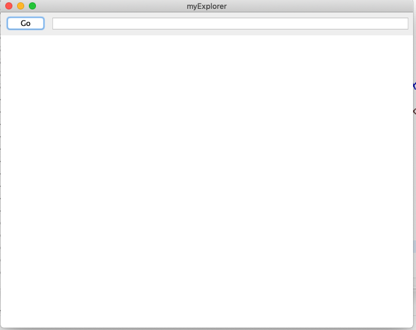
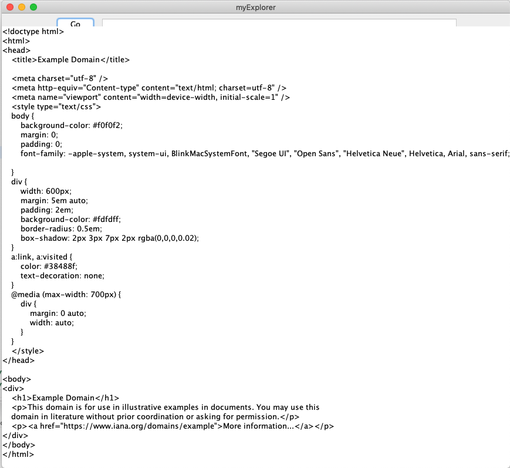

## DAT100: Java Programmering 7 - Uke 43

Start java-koden som skal brukes i denne oppgaven samt oppgave 1-5 nedenfor finnes på den vanlige github-oppbevaringsplassen for faget: https://github.com/dat100hib/dat100public

Start med å oppdatere den lokaleoppbevaringsplassen på PC'en og importer JPLab10-prosjektet inn i Eclipse. Veiledningen finnes her:

https://github.com/dat100hib/dat100public/blob/master/git/update.md

### Oppgave 1: Utvidet for-løkke og oppdatering av tabeller

Vi ønsker å skrive et program som oppdaterer en tabell `tab` av heltall ved å legge 1 til hvert element i tabellen.

Et første forsøk er koden nedenfor som først skriver ut elementer i tabellen `tab`, så forsøker å oppdatere tabellen ved å bruke en utvidet for-løkke, og til slutt skriver tabellen `tab` igjen.

```java
public class Oppdatering {

  public static void main(String[] args) {

  int[] tab = {1,2,3,4,5,6};

  // skriv ut
    System.out.print("[ ");

  for (int x : tab) {
  System.out.print(x + " ");
  }

  System.out.println("]");

  // oppdater
  for (int x : tab) {
  x = x + 1;
  }

  // skriv ut
  System.out.print("[ ");

  for (int x : tab) {
  System.out.print(x + " ");
  }

  System.out.println("]");
  }

}

```

### a)

Kjør programmet ovenfor. Blir resultatet som ønsket dvs. blir tabellen oppdatert?

### b)

Skriv om programmet ovenfor slik tabellen blir korrekt oppdatert dvs. der blir lagt en (1) til hvert heltall i tabellen.

### c)

Se på klassen `Data` implementeret nedenfor:

```java
public class Data {

	private int data;

	public Data(int d) {
		data = d;
	}
	public int getData() {
		return data;
	}
	public void setData(int data) {
		this.data = data;
	}
	public String toString() {
		return "" + data;
	}
}
```

samt programmet nedenfor som oppretter en tabell med referanser til tre `Data`-objekt o g bruker en utvidet for-løkke til å oppdatere alle Data-objekt ved bruk av get og set-metodern på objektene.

```java
public class DataTabell {

	public static void main(String[] args) {

		Data[] tab = new Data[3];

		tab[0] = new Data(1);
		tab[1] = new Data(2);
		tab[2] = new Data(3);

		for (Data d : tab) {
			System.out.print(d + " ");
		}
		System.out.println();

		for (Data d : tab) {
			d.setData(d.getData() + 1);
		}


		for (Data d : tab) {
			System.out.print(d + " ");
		}
		System.out.println();

	}
}
```

Kjør programmet. Oppdateres objektene som ønskes i utvidet for-løkke? Hvorfor virker en utvidet for-løkke her mens den ikke virket for oppdatering i deloppgave a)?

### Oppgave 2 - Filer og unntak

Koden nedenfor finnes i klassen `LeseFraFil.java`, pakken `no.hvl.dat100.oppgave2` i JPLab10 Eclipse-prosjektet

Main-metoden leser inn navn på fil og etterpå skrives hver linje i filen ut med et linjenummer foran.

```java
public class LeseFraFil {

  static String MAPPE_STR = System.getProperty("user.dir") + "/src/no/hvl/dat100/oppgave2/";

  static public void main(String[] args) throws FileNotFoundException {

  String filnavn;

  filnavn = JOptionPane.showInputDialog("Filnavn i mappen " + MAPPE_STR);

  File file = new File(MAPPE_STR + filnavn);
  Scanner reader = new Scanner(file);

  int linenumber = 1;

  // les innhold i filen linje for linje
  String line;

  while (reader.hasNextLine()) {
  line = reader.nextLine();
  System.out.println(linenumber + " " + line);
  linenumber++;
  }

  reader.close();

  // JOptionPane.showMessageDialog(null, "Filen " + filnavn + " finnes
  // ikke. \n" + e.getMessage());
  }
}
```

##### a)

Se på side 274 i Java.boken og start med å kjøre programmet ovenfor ved eks. ved å angi `LeseFraFil.java` som filnavn.

##### b)

Unntaket `FileNotFoundException` kan kastes/signaleres om filen vi forsøker å åpne ikke finnes. Siden det er et sjekket-unntak (checked exception) må vi bruke en throws-klausul for å angi at koden potensielt kan signalere et slik unntak. Kjør programmet – hva skjer om filen ikke finnes? For å fremprovosere unntaket må du taste inn et filnavn som ikke finnes.

##### c)

Skriv koden ovenfor om slik der brukes en `try-catch` blokk til å forsøke å lese inn innholdet i filen og slik `FileNotFoundException` unntaket fanges opp med en `catch` og en feilmelding gis til brukeren. Kjør programmet – hva skjer nå om filen ikke finnes?

##### d)

Utvid programmet slik brukeren får et antall forsøk til å angi en fil som finnes. Når antall forsøk er oppbrukt skal programmet stoppe.

##### e)

Skriv om programmet slik det bruker klassen `BufferedReader`:

https://docs.oracle.com/en/java/javase/11/docs/api/java.base/java/io/BufferedReader.html

til å lese en innholdet av filen. Generelt sett er bruken av denne klassen mer effektiv ift. `Scanner` da den leser større mengder av data fra fil om gangen.

### Oppgave 3 - MyWebBrowser og unntakshåndtering

I pakken `no.hvl.dat100.oppgave3` finnes starten på en enkel nettleser. Du skal utvide
programmet slik det kan hente web-sider for nettet. Programmet startes ved å kjøre main-metoden
som finnes i klassen `StartBrowser.java`. Gjøres dette fås følgende skjermbilde:



Ideen er at brukeren kan taste inn en URL i linjen på toppen eks. http://www.example.com, trykke på-Goknappen og så skal programmet hente web-siden og visen HTML-koden som kommer tilbake, eks:



Programmet bruker Java-swing biblioteket til å implementere en brukergrensesnitt. Dette skal vi komme tilbake til mot slutten av faget.

Når brukeren trykker på Go-knappen kjøres metoden `actionPerformed` i klassen `GoBtnListener.java`. Denne metoden skal hente en web-side på nettet ved å bruke klassen URL (se side 292 i boken) og skrive den ut i det store vinduet. Det meste av koden i metoden er kommentert ut fordi den mangler håndtering av de to sjekkede unntak (checked exceptions) som kan bli signalert:

- `MalformedURLException` hvis brukeren ikke taster inn tekst som er en lovlig URL eks. strengen «kjhdfdjhfkjd»

- `IOException` hvis nett-siden ikke finnes, eks. http://denne.finnes.ikke

Gjør ferdig implementasjonen av metoden `actionPerformed` ved å legge inn unntakshåndtering slik koden kan kompilere. Bruk try-catch-finally. Det meste av det som trengs - bortsett fra unntakshåndtering - finnes som kommentarer i koden.

Der skal skrives en feilmelding ut i det store feltet `webpagetextarea` om URL’en ikke er lovlig eller hvis nettsiden ikke finnes. Feltet der URL’en skrives inn `urltextfield` skal altid settes til en tom streng når brukeren har trykket på Go. I begge tilfeller finnes en metode `setText` på de to objekter `webpagetextarea` og `urltextfield` som representerer textfelter. Denne kan brukes til å sette teksten.

### Oppgave 4 - Flerdimensjonale tabeller

Denne oppgaven er relatert til miniExcel-eksempler fra undervisning 10 om Flerdimensjonale tabeller. Det kan være lurt å se på skissene som finnes i slides fra denne forelesnigen.

Koden nedenfor finnes i klassen `MiniExcel.java`, pakken `no.hvl.dat100.jplab10.oppgave4` i Eclipse-prosjektet JPLab10.

Programmet inneholder en to-dimensjonal tabell svarende til et Excel-ark med 4 rekker og 3 søyler med heltall.

```java
package no.hvl.dat100.miniexcel;

public class MiniExcel {

  private static int[][] data =
{ { 1, 2, 0 }, { 3, 4, 0 }, { 5, 6, 0 }, { 0, 0, 0 } };

  public static void skrivUt() {

  System.out.println("---------------");

  // TODO - START

  // iterer igjennom tabellen og skriv ut - utvidet for-løkke

  // TODO _END

  System.out.println("---------------");
  }

  public static void beregnSum() {

  // TODO - START

  // summer hver rad og skriv summen i siste element

  // TODO - END


  // TODO - START

  // summer hver kolonne og skrive summen i siste element

  // TODO - END

  }

  public static void main(String args[]) {

  skrivUt();

  beregnSum();

  skrivUt();
  }
}
```

##### a)

Implementer metoden `skrivUt()` som skriver ut tabellen på formen

```
-----
1 2 0
3 4 0
5 6 0
0 0 0
-----
```

##### b)

Implementer metoden `beregnSum()` som summerer rekker og søyler og skriver summen i siste posisjon. Dvs. utskrift etter sum er beregnet skal bli:

```
------
1 2 3
3 4 7
5 6 11
9 12 0
------
```

De to metodene i a) og b) skal fungere generelt – dvs. ikke kun for en tabell med størrelse 4x3.


### Oppgave 5 - Simulere terningkast: Random-klassen og tabeller

I denne oppgaven skal vi simulere terningkast. Et alternativ til å bruke `Math.random()` er å bruke `Random`-klassen. Denne klassen inneholder en metode `nextInt(int grense)` som returnerer et tilfeldig heltall fra og med 0 til (men ikke med) grense. Dette er en objekt-metode, så det må lages et Random-objekt før metoden kan brukes. Samme objektet kan brukes for å generere flere tilfeldige tall.

Få å løse denne oppgaven anbefales det å se på Eksempel 5.2, side 176 i java-boken. Skisse:

Du skal lage et program som kaster en terning 100 ganger og viser diverse resultater på skjermen. Skjermbildet skal se ut omtrent som nedenfor der det skrives ut 20 kast pr. linje i den første delen

```
TERNINGKASTSIMULATOR

3   2   6   1 ..	.. 1   6
5   2   1   6 ..	.. 5   6
.
.
6   3 ..	.. 3   1   1   4

Antall kast  : 100
Antall 6-ere :  14
Antall 5-ere :  16
.
.
Antall 1-ere :  20

Gjennomsnittskast : 3.56

Antall kast for å få den første 6-eren : 3

Terningverdien det var flest av : 1

```

Programmet skal organiseres i tre klasser:

- En klasse `Terning.java` som representerer terninger i programmet. Se nedenfor.

- En klasse `Simulering.java` som representerer resultater fra én simulering. Verdiene/kastene legges inn i en tabell med plass til 100 elementer . Metodene i klassen skal finne ut hvor mange kast det ble av hver verdi og legge de i en tabell med plass til seks elementer. **Nøtt:** Prøv å få til det siste uten å bruke if eller switch.

- En klasse `Utskrift.java` som har ansvar for utskrift av en simulering. Svarene skrives ut på skjermen slik det er indikert ovenfor. En viktig design beslutning er i hvilken klasse statistikken skal beregnes.

Begynnelsen på klassen `Terning.java` finnes nedenfor og i pakken `no.hvl.dat100.oppgave5`.

```java
public class Terning {

  // aktuell verdi for terningen
  private int oyne;

  public Terning() {
  // TODO
  }

  public int getOyne() {

  return 0; // TODO
  }

  public void trill() {
  // TODO
  }
}
```

#### Utvidelse - Frivillig

Utvid programmet slik utskriften bruker symboler for terningene. Et eksempel er gitt nedenfor

```
TERNINGKASTSIMULATOR

[:::] [...] [: :] [:.:] [ : ] [:.:] [ . ] [:::] [ : ] [ . ]
[:.:] [: :] [:.:] [ : ] [ : ] [:::] [:.:] [: :] [ . ] [...]
[ : ] [ . ] [: :] [:::] [: :] [...] [:.:] [:.:] [...] [ . ]
[ : ] [: :] [:.:] [: :] [:.:] [:::] [...] [: :] [...] [: :]
[:::] [:::] [ : ] [: :] [:.:] [...] [:::] [:.:] [: :] [...]
[: :] [...] [:::] [ . ] [:::] [...] [:.:] [...] [: :] [ . ]
[: :] [ : ] [ : ] [:.:] [ . ] [ . ] [:.:] [ . ] [...] [ . ]
[...] [: :] [ : ] [:::] [:::] [ : ] [:.:] [:.:] [...] [:::]
[ . ] [:.:] [:::] [: :] [:.:] [: :] [ . ] [:.:] [:::] [:.:]
[...] [: :] [...] [:::] [: :] [ : ] [:::] [:.:] [...] [ : ]

Antall kast : 100
Antall [:::]-ere:  17
Antall [:.:]-ere:  21
Antall [: :]-ere:  19
Antall [...]-ere:  17
Antall [ : ]-ere:  13
Antall [ . ]-ere:  13

Gjennomsnittskast : 3,730

Antall kast for å få den første [:::]-eren: 1

Terningverdien det var flest av : [:.:]
```

### Oppgave 6 - Arrays og kjøretid for Java-programmer

Oppgaven fokuserer på bruk Java API dokumentasjon https://docs.oracle.com/en/java/javase/11/docs/api/index.html og måling av utføringstid for programmer.

Når der i API dokumentasjonen for Java plattformen står at en metode (eller klasse) er «deprecated» betyr at den er foreldet og at den dermed ikke skal brukes når vi lager ny kode. Grunnen til at foreldede metoder er fortsatt en del av mange Java pakker er for å sikre at koden som bruker en eldre versjon av API’en fortsatt kan kjøre uten at vi trenger å endre i koden.

De fleste programmene vi skriver i første semester vil utføres så raskt at det er vanskelig å måle utføringstiden av programmet.  På forelesningene har vi sagt at det finnes ferdige klasser i Java for å behandle tabeller. En slik klasse er `Arrays` (i pakken `java.util`): https://docs.oracle.com/en/java/javase/11/docs/api/java.base/java/util/Arrays.html

Her finnes det blant annet metoder for å sortere en tabell. Dersom vi sorterer en tabell med for eksempel 1000000 heltall, kan vi måle tiden ved hjelp av metoder i klassen `System` (i pakken java.lang):

https://docs.oracle.com/en/java/javase/11/docs/api/java.base/java/lang/System.html

eller klassene `Instant` og `Duration` (i pakken `java.time`):

https://docs.oracle.com/en/java/javase/11/docs/api/java.base/java/time/Instant.html

https://docs.oracle.com/en/java/javase/11/docs/api/java.base/java/time/Duration.html

##### a)

Vi skal sette av plass til en tabell med 1000000 elementer. Deretter fyller vi den med slumptall (tilfeldige tall). Det finnes flere måter å generere tilfeldige tall i Java. Den enkleste er kanskje metoden `random()` i klassen `Math`:

https://docs.oracle.com/en/java/javase/11/docs/api/java.base/java/lang/Math.html#random()

Denne metoden returnerer et flyttall større eller lik 0 og mindre enn 1.

Tabellen skal sorteres ved å bruke en passende metode fra klassen `Arrays`. Tiden for selve sorteringen skal måles og svaret skal skrives ut i millisekunder.

Det å lese API dokumentasjon for klassene `System` (eller `Instant` og `Duration`), `Math` og `Arrays` for å finne de rette metoder er en del av oppgaven.

##### b)

Varier antall av elementer i tabellen og undersøk hvordan utføringstiden påvirkes.
