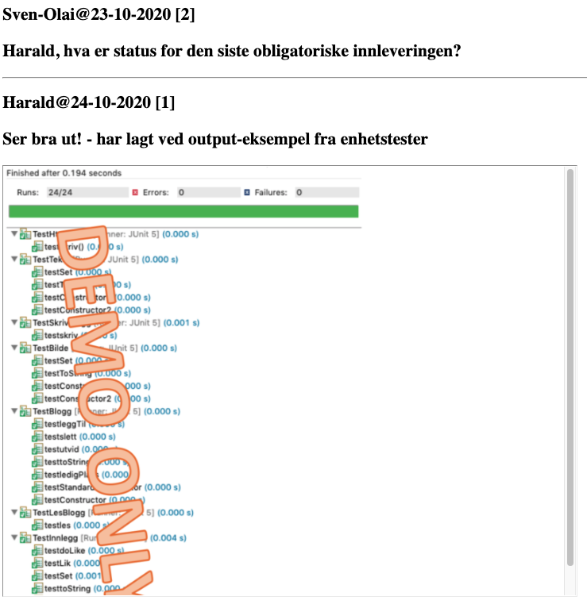

# DAT100: Java Programmering 11 - uke 44

## Introduksjon

Dere skal skrive Java-kode for klasser til et blogg-system på nettet. I tilegg skal dere skrive metoder som bruker input/output og filer for å lagre å hente inn blogg-innlegg.  

Oppgavene på denne programmeringslab er **obligatoriske** og *kan* løses i grupper med opptil fire studenter. Deler av oppgave 3 samt 5, 6 og 7 er valgfrie. De valgfrie oppgaver kan gjøres uavhengig av hverandre og vil resultere i en helt grunnleggende web-applikasjon der det er mulig å vise bloggen i HTML format i en nettleser.

Selve oppsettet av oppgavene med startkode og enhetstester er veldig lik progranmmeringsprosjektet. Husk å spørre om hjelp om der skulle være problemer med å kjøre enhetstestene eller noe som er uklart i oppgavene.

## Innlevering

Besvarelsen leveres inn ved å pushe java-koden med oppgavene opp på den github-oppbevaringsplassen som blev opprettet når gruppen gjorde en "fork" av github oppbevaringsplasen med startkode. Som besvarelse på Canvas legges inn en lenke til oppbevaringsplassen samt et skjermdump som viser resultat av å kjøre enhetstester. Se nederst på denne siden for hvordan et skjermdump kan se ut.

## Eclipse-prosjekt med startkode (Fork + Clone + Import)

### Fork oppbevaringsplassen

Gå inn på github på oppbevaringsplassen som inneholder start-koden:

https://github.com/dat100hib/dat100-jplab11-startkode.git

Begynn med å opprette en kopi av denne oppbevaringsplassen ved å bruke "fork" (se øverste høyre hjørne på github-websiden). Du vil da få en kopi av oppbevaringsplassen med startkoden på din egen github konto.

### Klone og importere startkode i Eclipse

Du må nå laste ned (klone) oppbevaringsplassen med kode som du opprettet ovenfor. Det er **viktig** at du **ikke** kloner https://github.com/dat100hib/dat100-jplab11-startkode.git men den oppbevaringsplassen som du opprettet på din egen konto da du utførte fork.

1.	Velg *Code* på github-siden

2.	Velg lenken og last ned en kopi (clone) oppbevaringsplassen på samme måten som du har gjort i Eclipse i tidligere oppgaver for å importere.

Du skal nå ha et prosjekt i Eclipse med navnet `dat100-jplab11-startcode`

Startkoden har en pakke for hver oppgave.

## Eclipse-prosjekt med enhetstester

For å kunne teste metodene som implementeres finnes et Eclipse-prosjekt med enhetstester via:

https://github.com/dat100hib/dat100-jplab11-testing.git

Du kloner oppbevaringsplassen og importerer inn i Eclipse på samme måten som tidligere men nå med oppbevaringsplassen gitt i lenken ovenfor. Du trenger **ikke** å gjøre fork på denne oppbevaringsplassen først siden du ikke trenger din egen kopi av oppbevaringsplassen på github.

Du skal nå ha et prosjekt i Eclipse med navnet `dat100-jplab11-testing` som inneholder en rekke enhetstester (unit-tests) implementert ved bruk av rammeverket JUnit. Det er ikke et krav i oppgaven å legge til flere enhetstester.

Tester for en klasse `X.java` finnes i testklassen `TestX.java`. Kjørsel av enhetstester er tilsvarende som i programmeringsprosjektet.

## Oppgave 1 - Abstrakt klasse

Klassen `Innlegg` skal fungere som en basis-klasse for bloggen. De konkrete innlegg vil bli representeres via objekter av subklasser av `Innlegg`. Klassen er en abstrakt klasse siden vi ikke kommer til å skulle opprette objekter av klassen `Innlegg` men "kun" bruke den til å samle fellestrekk mellom de ulike typer innlegg.

#### a)

Gjør ferdig implementasjon av den *abstrakte* klassen `Innlegg.java` med objektvariable `id` (heltall), `bruker` (tekststreng), `dato` (tekststreng), og antall `likes` (heltall). De fire objektvariable skal ikke være synlige utenfor klassen. Objektvariablen `id` skal brukes om en unik identifikasjon på et innlegg.

#### b)

Klassen skal ha to konstruktører:


```java
public Innlegg(int id, String bruker, String dato)
public Innlegg(int id, String bruker, String dato, int likes)
```

som gir verdi til objektvariablene. Konstruktøren som bare tar tre parametre skal sette `likes` lik 0.

#### c)

Klassen skal ha get- og set- metoder for de tre objektvariable `id`, `bruker` og `dato`.  

#### d)

Implementer metoden `void doLike()` som øker antall `likes` for innlegget med 1.  

#### e)

Implementer metoden `public String toString()` som returnerer en tekststreng representasjon på formen:

```
"1\nOle Olsen\n23-10-2019\n7\n"
```

der det først tallet er `id` for innlegget og `7` er antall `likes` for eksemplet.

#### f)

Implementer metoden `public boolean erLik(Innlegg innlegg)` som returnerer `true` hvis og kun hvis innlegget har samme id som innlegget `innlegg` git med som parameter.

## Oppgave 2 - Subklasser

Implementer subklassen `Tekst` for klassen `Innlegg` som skal ha en objektvariabel `tekst` som er teksten i et blogg-innlegg. Implementer videre subklassen `Bilde` for klassen `Tekst` som skal ha en objektvariabel `url` (tekststreng) som gir en URL (web-lenke) til der vi kan finne bildet for blogg-innlegget. Dvs. klassen `Bilde` er subklasse av klassen `Tekst` som igjen er subklasse av klassen `Innlegg`.

Implementer konstruktørene i de to klassene `Bilde` og `Tekst` som initialiserer alle objektvariable (også de som er arvet fra superklassen) ut fra de verdier som er gitt med som parametre til konstruktøren. Begge subklassene skal ha to konstruktører.

Bruk private/protected på alle objektvariabler sli som du finner nødvendig og lag public get-metoder / set-metoder.

Implementer metoden `String toString()` i hver av subklassene `Bilde` og `Tekst` som gir en tekst-representasjon av alle objektvariable inkludert de som er arvet fra superklassen.

For klassen `Tekst` skal strengen som returneres ha formen:

```
TEKST\n1\nOle Olsen\n23-10-2019\n0\nen tekst\n
```

der `en tekst` er verdien av objektvariablen `tekst`.

For klassen `Bilde` skal strengen som returnere ha formen:

```
BILDE\n1\nOle Olsen\n23-10-2019\n0\net bilde\nhttp://www.picture.com/oo.jpg\n
```

## Oppgave 3 - Objektsamling

Gjør ferdig implementasjon av metoder i klassen `Blogg` som implementerer en samling av Innlegg-objekt. For å løse denne oppgaven anbefales det å lese avsnitt 9.1 i Java-boken samt forelesningsnotater fra forelesning F20 om objekt-samlinger.

##### a)

Klassen `Blogg` skal lagre `Innlegg`-objektene sammenhengene fra starten av tabellen og ha følgende objektvariable:

- `innleggtabell` som er en referanse tabell av `Innlegg`-objekt.
- `nesteledig` som angir antall `Innlegg`-objekt som er lagret i tabellen og dermed neste ledige posisjon i tabellen

##### b)

Implementer en standard konstruktør:

```java
public Blogg()
```

der startstørrelsen på tabellen blir satt til 20 samt en konstruktør:

```java
public Blogg(int lengde)
```

der parameteren angir lengden angir startstørrelsen på tabellen.

##### c)

En metode `public int getAntall()` som returnerer antall innlegg-objekt som aktuelt er lagret i tabellen.

##### d)

En metode `public Innlegg[] getSamling()` som returnerer en peker til tabellen av innlegg-objekt.

##### e)

En metode `public int finnInnlegg(Innlegg innlegg)` som returnerer indeks (posisjon) i tabellen for et innlegg i samlingen med samme id som parameteren `innlegg` (om en slik finnes) og -1 ellers. Bruk `erLik`-metoden for `Innlegg`-objekt i implementasjonen

##### f)

En metode `public boolean finnes(Innlegg innlegg)` som returnerer `true` om der finnes et innlegg i samlingen med samme `id` som innlegget gitt ved parameteren `innlegg`.

##### g)

En metode `public boolean ledigPlass()` som returnerer `true` om der er ledig plass i samlingen og `false` ellers.

##### h)

En metode `public boolean leggTil(Innlegg innlegg)` som legger `innlegg` inn i tabellen. Dersom der ikke finnes et innlegg i tabellen med samme id som `innlegg` skal metoden legge til innlegget på neste ledige plass i tabellen. Ellers skal ikke metoden legge inn `innlegg` i tabellen. Metoden skal returnere `true` om innlegget blev lagt til og `false` ellers.

##### i)

En metode `public String toString()` som returnerer data i tabellen som en streng der første linje i strengen angir antall `Innlegg`-objekt i tabellen, eks., en tabell med to innlegg ( et tekst-innlegg og et bilde-innlegg):

```java
2\nTEKST\n1\nOle Olsen\n23-10-2019\n0\nen tekst\nBILDE\n2\nOline Olsen\n24-10-2019\n0\net bilde\nhttp://www.picture.com/oo.jpg\n
```

##### j) - valgfri

En metode `public void utvid()` som oppretter en ny tabell av innlegg-objekt som er dobbelt så stor og flytter elementene over i denne.

##### k) - valgfri

En metode `public boolean leggTilUtvid(Innlegg innlegg)` som legger `innlegg` inn i tabellen. Dersom der ikke finnes et innlegg i tabellen med samme id som `innlegg` skal metoden legge til innlegget på neste ledige plass i tabellen. Ellers skal ikke metoden legge inn `innlegg` i tabellen. Dersom tabellen er full, skal metoden opprette en utvidet tabell og deretter sette inn innlegget i den nye tabellen. Metoden skal returnere `true` om `innlegg` ble lagt inn i tabellen.

##### l) - valgfri

En metode `public boolean slett(Innlegg innlegg)` som sletter innlegget `innlegg` fra samlingen. Vi antar at innlegget med samme `id` er det samme innlegget. Metoden skal returnere `true` om innlegget ble slettet.

##### m) - valgfri

En metode `public int[] search(String user, String ord)` som returnere en tabell av id'er på alle innlegg i bloggen der teksten inneholder strengen angitt med parameteren `ord`.

## Oppgave 4: Skrive blogg til fil

For å løse denne oppgaven anbefales det å lese avsnitt 7.1 og 7.4 i java-boken og se på notater fra forelesninger om filer og om unntak. Denne oppgaven samt oppgave 5 nedenfor er også relatert til:

https://github.com/dat100hib/dat100public/blob/master/programmering/jplab10/JP10.md#oppgave-2---filer-og-unntak

Implementer følgende metode i klassen `SkrivBlogg.java`:

```java
public static boolean skriv(Blogg samling, String mappe, String filnavn)
```

som skriver ut samlingen til fil. Eksempel på innhold av fil for en samling med to elementer:

```java
2
TEKST
1
Ole Olsen
23-10-2019
0
en tekst
BILDE
2
Oline Olsen
24-10-2019
0
et bilde
http://www.picture.com/oo.jpg
```

Metoden skal returnere `true` om filen blev skrevet og skal håndtere eventuelle unntak ifm. fil-håndtering ved å bruke try-catch. **Hint**: bruk `toString()`-metoden på innlegg-samling. Filen `bloggkorrekt.dat` i Eclipse-prosjektet med tester inneholder korrekt resultat. Når testen `TestSkriv`-testen kjøres vil der bli skrevet i filen `blogg.dat` der resultatet kan inspiseres. Dvs. om metoden er korrekt implementert skal innholdet av filen `blogg.dat` være lik innholdet av filen `bloggkorrekt.dat`

## Oppgave 5: Lese blogg fra fil - valgfri

Implementer følgende metode i klassen `LesBlogg.java`:

`public static Blogg les(String mappe, String filnavn)`

som leser inn bloggen fra en fil på formatet som i oppgave 4 og returnerer en samling (blogg) med de `Innlegg`-objekt som er lest inn.

Metoden skal håndtere eventuelle unntak ifm. filer vha. try-catch. Det kan antas innholdet i filen er på korrekt format. Testen `TestLesBlogg.java` vil forsøke å lese inn filen `bloggkorrekt.dat`.

**Hint:** Start med å lese inn første linje og opprett en blogg med det antall innlegg som står angitt i første linje av filen. Les inn et innlegg om gangen og hver gang et innlegg leses inn, finn ut om det er en tekst-innlegg eller et bilde-innlegg. Dette bestemmer da hva som evt. skal leses videre.

## Oppgave 6: HTML - valgfri

I denne oppgaven skal bloggen kunne skrives til en fil i HTML format. Klassen `HtmlBlogg` er en subklassen av klassen `Blogg` der `toString()`-metoden overskrives slik den istedet for den vanlig tekst-representasjon genererens en representasjon av bloggen in HTML format. Testen i `TestHtmlBlogg` oppretter en blogg og bruker `skrivBlogg`-metoden med en `HtmlBlogg` til å skrive resultatet i filen `blogg.html`. Innholdet av filen ved korrekt implementasjon bør være eksempelvis:

```html
<html>
        <head>
                <title>DAT100 Blogg</title>
        </head>
        <body>
                <h2>Ole Olsen@23-10-2020 [0]<h2>
                <p>DAT100 oppgave 6<p>
                <hr>
                <h2>Oline Olsen@24-10-2020 [0]<h2>
                <p>HVL logo<p>
                <iframe src="https://www.west-norway.no/wp-content/uploads/2018/05/HVL-nettside.jpg" height=600 width=800></iframe><hr>
        </body>
</html>
```  

HTML-koden fra `<html>` til `<body>` samt fra `</body>` til `</html>` skal settes inn i `toString`-metoden mens HTML-koden for de enkelte innleggene skal genereres av en metoder:

```java
public String toHTML()
```

i hver av klassene  `Innlegg`, `Tekst` og `Bilde`.

## Oppgave 7: Blogg-webtjener - valgfri

Klassene i pakken `no.hvl.dat100.oppgave7` inneholder Java-koden for en forenklet web-tjener basert på HTML-generering fra oppgave 6. Såfremt oppgave 6 er korrekt implementert skal det være mulig å kjøre main-metoden i klassen `WebServer.java` hvilket skal gi følgende output i konsollen:

```
TCP server starting # 8080
SERVER ACCEPTING
```

og ved å klikke på følgende lenke:

http://localhost:8080

skal en få følgende resultat i nettleseren:



Den forenklede web-tjener håndterer tre HTTP GET request før den stopper og må gjenstartes. Dette antall kan justeres i klassen `Configuration.java`. Java-koden i `WebServer.java`og `BloggApp.java` gjør bruk av Java nettverksprogrammering som dere skal lære mer om i et senere fag.
