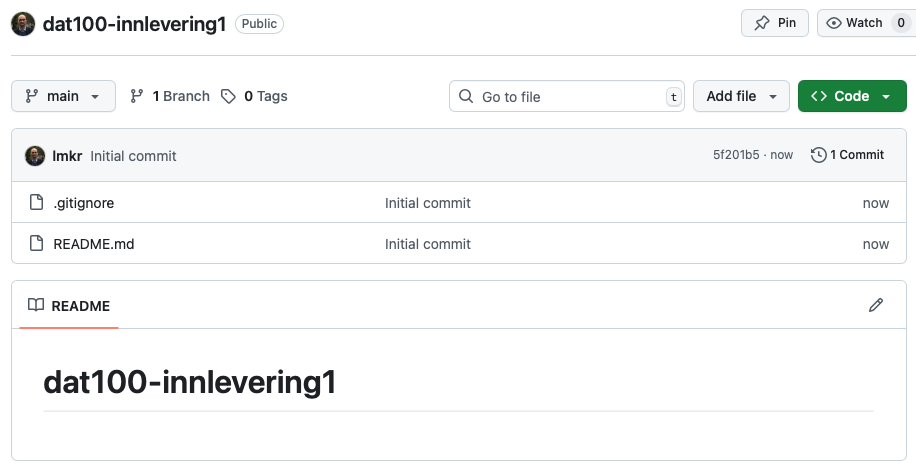

# DAT100: Java Programmering 2 - uke 35

Oppgavene på denne programmeringslab er oppdelt i **grunnleggende oppgaver** (G oppgaver), basis oppgaver (B oppgaver), samt valgfrie oppgaver (V oppgaver) som beskrevet på [forrige programmeringslab](https://github.com/dat100hib/dat100public/blob/master/programmering/jplab1/JP1.md) 

I tillegg er der en **obligatoriske oppgave** O1 der dere skal opprette en brukerkonto på GitHub. Denne skal dere bruke etterhvert bla. for å levere inn koden for neste obligatoriske oppgave. Detaljer for hva dere skal levere inn for O1-oppgaven samt frist finner dere på Canvas.

## Grunnleggende oppgaver

Koden i oppgavene nedenfor skrives inn i `main`-metode i en klasse med samme navn som oppgaven (ved **TODO** kommentaren):

```java
public class OppgaveG {

	public static void main(String[] args) {
		// TODO Auto-generated method stub

	}
}
```

tilsvarende som dere gjorde på forrige programmeringslab.

### Oppgave G1 - If-valgsetninger

Modulo operatoren i Java `%` gir rest ved heltalsdivisjon. Eksempelvis gir uttrykket `5 % 2` resultatet `1` siden 5 delt på 2 gir `1` til rest. Tilsvarende gir `6 % 2` resultatet `0` siden der ikke er noen rest ved å dele `6` på `2`. 

Generelt for et heltall `n` kan vi bruke `n % 2` til å avgjøre om verdien av `n` er et partall eller et oddetall ved å se på rest ved divisjon med `2` dvs. resultatet av `n % 2`. Hvis det er `0` er verdien av `n` et partall og om resultat er `1` er det et oddetall. 

Skriv et Java program som har en variabel `n` og som i begynnelsen av programmet har en tildelingssetning som setter verdien av `n` til et heltall. Hvis verdien av `n` i programmet er satt til et partall da skal programmet skrive ut teksten `Tallet er et partall` og om `n` settes til et oddetall da skal programmet skrive ut `Taller er et oddetall`.  

Test programmet for ulike tildelinger av heltall til `n`.

### Oppgave G2 - Switch-valgsetninger

Skriv et Java program som bruker en switch-setning til å finne ut gitt et nummer på en dag i uken (1,2, .. 7) hvilken ukedag det svarer til.

Programmet skal ha en variabel `dn` som kan settes til en verdi mellom 1 og 7. Om `nd` har verdien `1` skal programmet skrive ut `Mandag`, om `nd` har verdien `2` skal programmet skrive ut `Tirsdag` osv. Hvis variablen `nd` i programmet settes til en verdi som ikke er mellom 1 og 7 da skal programmet skrive ut `Ulovlig nummer`. 

Test programmet for ulike tildelinger av verdier til variablen `nd`.

### Oppgave G3 - Input/Output og Math-biblioteket

**Oppgave 6 Kap. 2 i Java-boken:** Metoden `min` i klassen `Math` finner det minste av to tall, eks. `Math.min(1,10) = 1`. Bruk denne metoden til å beregne og skrive ut det minste av 4 tall som brukeren skriver inn. Du kan finnes et eksempel på innlesing av tall fra brukeren via `Scanner` på forrige programmeringslab: https://github.com/dat100hib/dat100public/blob/master/programmering/jplab1/JP1.md#oppgave-b2---input-via-scanner

Husk å importere Math-biblioteket ved å legge inn:

```
import java.lang.Math.*;
```

slik du kan skrive eks. `Math.min` i koden der du skal bruke min-metoden.

## Basis oppgaver

### Oppgave B1 - Bruker input og output

**Oppgave 9 Kap 2. i Java-boken:** Lag et program som ber brukeren om å skrive inn en dato som tre heltall: et dagnummer, et månedsnummer, og et årstall. Skriv datoen ut på vanlig måte med punktum og skilletegn, f.eks, `4.11.2013`. Det er ikke nødvendig å sjekke at datoen er lovlig.

### Oppgave B2 (Gruppearbeid) - Datatyper og uttrykk

Nedanfor finn du eit lite Java-program. Programmet inneheld nokre feil. Først går kvar enkelt student gjennom programmet på eigahand (utan å bruke JDoodle) og prøver å finne feila og kva som blir skrive ut i dei skrivesetningane som kan utførast. Metoden `length()` gir lengden på en streng.

Deretter set 2 - 3 studentar seg saman og diskuterer svara. Bli einige om svara før de skriv inn programmet og sjekkar at de har rett. Dersom de har feil, prøv å forstå kvifor de tok feil. Viss ikkje de forstår kvifor, spør.

```java
public class Eksperiment
  public static void main(String[] args) {

    int a = 5;
    String s = "Hei";
    b = 4.2;

    System.out.println(a);
    System.out.println(s);
    System.out.println(b);
    System.out.println(s + a + 3);
    System.out.println(3 + a + s);
    System.out.println(s - "H");
    System.out.println(7 / a);
    System.out.println(13 - 2 * 5);

    int c = 1578;
    System.out.println(c.length());
    System.out.println(s.length());
```

### Oppgave B3 - Valgsetninger

Se på koden for inntasting av brukernavn og passord:

https://github.com/dat100hib/dat100public/blob/master/undervisning/U02SetningerUttrykk/Login.java


Legg till to `String`-variable som inneholder korrekt brukernavn og passord. 

Bruk en if-setning til å sjekke om der er gitt korrekt login informasjon. For en tekststreng (String) `s1` kan `s1.equals(s2)` (se https://docs.oracle.com/en/java/javase/21/docs/api/java.base/java/lang/String.html) brukes til å sjekke om to strenger er lik (se etter `equals`-metoden på siden).

I praksis vil en aldri legge inn brukernavn og passord i selve programmet da det utgjør en sikkerhetsrisiko - men vi gjør det slik inntil vi har lært mer om programmering.

### Oppgave B4 - Uttrykk og vekslepenger

Skriv et program som leser inn en pris og et beløp (begge heltall) som er betalt og beregner hvor mange 10 og 1-kr kunden skal ha igjen i vekslepenger slik kunden får færrest mulig antall mynter tilbake.

**Hint:** Operatoren `%` (modulo) gir rest ved heltalldivisjon.

## Obligatorisk oppgave: opprette GitHub-konto

Sålangt i emnet har vi brukt GitHub for å kunne lage en åpen oppbevaringsplass i skyen: https://github.com/dat100hib/dat100public der vi kan legge ut oppgaver for programmeringslab og der dere kan få tilgang til kode-eksempler fra undervisningen. 

Etterhvert i emnet skal vi skal vi bruke mer av funksjonaliteten som Git og GitHub tilbyr slik dere kan levere inn kode, få tilgang til startkode for oppgaver, og slik dere kan jobbe sammen om koding på en strukturet måte.

Første steg for at dere skal komme igang med mer avansert bruk av Git er å opprette en brukerkonto samt en første egen oppbevaringsplass. Oppbevaringsplassen skal brukes for at dere kan levere inn Java-koden for den obligatoriske innleveringen som kommer på neste programmeringslab.

### a) Brukerkonto

Gå inn på https://www.github.com og opprett en brukerkonto ved å bruke `Sign Up`. Om du allerede har en brukerkonto på GitHub trenger du ikke opprette en ny brukerkonto. Du vil få en e-post fra GitHub der du blir bedt om å verifisere at e-post addressen du bruker for å opprette kontoen er gyldig.

### b) Opprette oppbevaringsplass (repository)

1. Login på Github (om du ikke allerede er logget inn) og gå til `Repositories`-siden din (kan finnes via bruker-ikonet øverst til høyre)

2. Velg *New* for å opprette et nytt repository. Under `General` gi det navnet `dat100-innlevering-1`, under `Configuration` velg *Add a README file*, og under *Add .gitignore* velg *Java*.

3. Trykk på *Create Repository*. Du har nå opprettet et repository og bildet på skjermen skal være tilsvarende nedenfor.

4. Kopier linken til oppbevaringsplassen i nettleseren og lever inn denne via Canvas som svar på oppgaven.

 

## Valgfrie oppgaver

### Oppgave V1 - Ulike if-valgsetninger 

Du skal lage et program som leser inn tre heltall fra brukeren, og skriver de ut igjen tallene sortert i stigende rekkefølge.

#### a)

Løs oppgaven ved bare å bruke if-setninger.

#### b)

Løs oppgaven ved å bruke if-then-else-setninger.

### Oppgave V2 - Valgsetning: if versus switch

Så på eksemplene fra forelesning om valgsetninger:

https://github.com/dat100hib/dat100public/tree/master/undervisning/U03Valgsetninger

#### a)

Prøv å skrive om programmet som bruker switch-setning:

https://github.com/dat100hib/dat100public/blob/master/undervisning/U03Valgsetninger/SwitchEksempel.java

slik det bruker en `if-then-else`-valgsetning istedet for. Prøv også å skrive programmet slik the bruker `if-else if-else ... else`

#### b)

Prøv om du kan skrive om programmet som bruker if-valgsetning:

https://github.com/dat100hib/dat100public/blob/master/undervisning/U03Valgsetninger/IfEksempel.java 

slik det bruker en `switch`-valgsetning istedet for. Utvid programmet slik den skrive ut teksten "GUL" hvis co2-nivå er mellem 500 og 700. Kan switch-setning brukes da?
