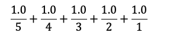

# DAT100: Java Programmering 2 - uke 36

Oppgavene på denne programmeringslab er oppdelt i **grunnleggende oppgaver** (G oppgaver), basis oppgaver (B oppgaver), samt valgfrie oppgaver (V oppgaver) som beskrevet på [forrige programmeringslab](https://github.com/dat100hib/dat100public/blob/master/programmering/jplab1/JP1.md) 

To av oppgavene nedenfor (B5 og B6) vil være en del av obligatorisk innlevering som kommer i neste uke.

## Grunnleggende oppgaver

Koden i oppgavene nedenfor kan skrives inn i en `main`-metoden en klassen med samme navn som oppgaven (ved **TODO** kommentaren):

```java
public class OppgaveG {

	public static void main(String[] args) {
		// TODO Auto-generated method stub

	}
}
```

### Oppgave G1

#### a)

Legg til en deklarasjon av en variabel `n` of typen heltall (`int`) i main-metoden.

#### b)

Legg til en for-løkke som skriver ut tallene fra `1` opptil `10`. Kjør programmet å se at det fungerer.

#### c)

Modifiser for-løkken slik den skriver tallene fra `1` til (men ikke med) verdien av variabelen `n`. Kjør programmet der du en gir `n` forskjellige verdier og se at programmet gir korrekt utskrift. Hva skjer om `n` settes til en negativ verdi?

### Oppgave G2

Bruk en while-løkke til å skrive ut tallene fra `20` ned til `1`.

### Oppgave G3

#### a)

Skriv et Java program som bruker en for-løkke med en tellevaribel `i` som starter på `1` og løper opp til og med `20`

#### b)

Legg til en switch-setning inne i for-løkken slik programmet skriver ut `A` hvis `i` har verdien, `1` og `B` om i har verdien `2`, og `C` ellers.

#### c)

Modifiser programmet fra b) slik det bruker en valgsetning (if-else if ... else) i stedet for en switch-setning.

### Oppgave G4

Lag et program som leser inn to heltall fra brukeren og skriver ut summen av de. Modifiser programmet slik det kan beregne areal av et rektangel der lengden og bredden på rektangelet leses inn fra brukeren.

### Oppgave G5

**Oppgave 6 Kap. 2 i Java-boken:** Metoden `min` i klassen `Math` finner det minste av to tall dvs. `min(1,10) = 1`. Bruk denne metoden til å beregne og skrive ut det minste av 4 tall som brukeren skriver inn. 

### Oppgave G6 (Gruppearbeid)

Nedanfor finn du eit lite Java-program. Programmet inneheld nokre feil. Først går kvar enkelt student gjennom programmet på eigahand (utan å bruke Eclipse) og prøver å finne feila og kva som blir skrive ut i dei skrivesetningane som kan utførast. Metoden `length()` gir lengden på en streng.

Deretter set 2 - 3 studentar seg saman og diskuterer svara. Bli einige om svara før de skriv inn programmet og sjekkar at de har rett. Dersom de har feil, prøv å forstå kvifor de tok feil. Viss ikkje de forstår kvifor, spør.

```java
public class Eksperiment
  public static void main(String[] args) {

    int a = 5;
    String s = "Hei";
    b = 4.2;

    System.out.println(a);
    System.out.println(s);
    System.out.println(b);
    System.out.println(s + a + 3);
    System.out.println(3 + a + s);
    System.out.println(s - "H");
    System.out.println(7 / a);
    System.out.println(13 - 2 * 5);

    int c = 1578;
    System.out.println(c.length());
    System.out.println(s.length());
```

## Basis oppgaver

### Oppgave B1 - Bruker input og output

**Oppgave 9 Kap 2. i Java-boken:** Lag et program som ber brukeren om å skrive inn en dato som tre heltall: et dagnummer, et månedsnummer, og et årstall. Skriv datoen ut på vanlig måte med punktum og skilletegn, f.eks, `4.11.2013`. Det er ikke nødvendig å sjekke at datoen er lovlig.

### Oppgave B2 - Input og for-løkker

Vi kan lese et tall inn fra brukeren i et Java program ved å legge følgende til i toppen av filen (etter `package`)

```java
import static javax.swing.JOptionPane.*;
import static java.lang.Integer.*;
```

og bruke følgende setninger på den plass i programmet der vi ønsker å lese inn et tall fra brukeren og lagre det (her lagrer vi tallet i en variabel `tall`)

```java
String tallTxt = showInputDialog("Gi et tall:");

int tall = parseInt(tallTxt);
```

#### a)

Skriv et program som leser et tall inn fra brukeren og skriver tallet ut på skjermen via `System.out.println`-metoden.

#### b)

Utvid programmet ovenfor med en `for`-løkke slik programmet leser inn fem (5) tall og for hver gang et tall er lest inn skrives dette ut på skjermen.

### Oppgave B3 - Om tall i Java

Fra matematikken vet vi at tall ikke har en øvre grense og at når vi regner med desimaltall så får vi nøyaktige svar. Det trenger ikke være riktig når vi programmerer. Det er to ting som er *spesielt viktig* å være klar over:

-	Heltall har en øvre og nedre grense.
-	Det har for så vidt også flyttallene (desimaltallene), men det er sjelden et problem.  For disse kan beregninger bli litt unøyaktige.  

I denne oppgaven skal vi se på eksempler på dette.

#### a) 

Koden nedenfor beregner toerpotenser der eksponenten er 0, 1, …, 5.

```java
int n = 5;
int tall = 1;

for (int i = 0; i <= n; i++) {
    System.out.println(tall);
    tall = tall * 2;
}
```

Kjør koden og sjekk at det stemmer. Deretter endrer du `n` til 32 og utfører koden på nytt. Hva skjer på slutten? (Forklaring til slutt i oppgaven)

#### b) 

Fra matematikken vet vi at når vi summerer en rekke med tall, så har det ikke betydning i hvilken rekkefølge vi utfører addisjonene. Det kan det ha når vi programmerer. 

**Eksempel:**

Vi ønsker å finne summen nedenfor.


For `n = 5` blir dette


Dette kan gjøres slik i Java:

```java
int n = 5;
double fraVenstre = 0;
    
for (int i = 1; i <= n; i++) {
    fraVenstre = fraVenstre + (1.0 / i);
}
```

Fra matematikken vet vi at det ikke har betydning i hvilken rekkefølge addisjonene blir utført i. Dvs. vi vil få samme resultatet og vi summerer fra høgre mot venstre som vist nedenfor



Lag en ny løkke som beregner denne summen. Når du sammenligner svarene vil du se at de er litt ulike.

**Det som er viktig for oss:** Når vi regner med flyttall, så kan vi få unøyaktige svar. Det betyr at vi skal være forsiktige å sjekke om to flyttall er like (`==`), men heller sjekke om avstanden er svært liten.
I DAT100 blir ikke dette et problem, men det er viktig å være klar over dette for senere emner.

**Forklaring på hva som skjer i a):** Typen `int` har en øvre grense. På et tidspunkt blir tall større enn grensen. Vi får det som kalles overflyt (overflow). I den aktuelle oppgaven med `n=32`, kan vi unngå problemet ved å bruke typen `long` i stedet for int.  Denne kan inneholde større heltall, men etter hvert som vi dobler tall vil vi få samme problem (igjen). 

### Oppgave B4 - Uttrykk og vekslepenger

Skriv et program som leser inn en pris og et beløp (begge heltall) som er betalt og beregner hvor mange 10 og 1-kr kunden skal ha igjen i vekslepenger slik kunden får færrest mulig antall mynter tilbake.

**Hint:** Operatoren `%` (modulo) gir rest ved heltalldivisjon.

### Oppgave B5 - Blir en del av obligatoriske innlevering neste uke

#### a)

Lag et program som leser inn en poengsum (heltall) som en student har oppnådd på en prøve, og finn
og skriv ut den karakteren A-F dette tilsvarer. Grenser for de ulike karakterene skal være:


Skriv ut feilmelding ved ugyldig poengsum (negativ verdi eller over 100).

#### b)

Utvid programmet i pkt. a) slik at det kan lese inn poengsummer fra 10 studenter og skrive ut karakteren (eller feilmelding) etter hver innlesing. **HINT:** hvordan kan du bruke en for-løkke til dette.

#### c)

Legg inn kontroll på innlesinga i programmet i pkt. b) slik at ugyldige poengsummer (negativ verdi eller over 100) må leses inn på nytt.

### Oppgave B6 - Blir en del av obligatoriske innlevering neste uke

En trinnskatt er en progressiv skatt på bruttolønn som beregnes når inntekten er
høyere enn 208 050 kr.

Se https://www.skatteetaten.no/satser/trinnskatt/?year=2024#rateShowYear for aktuelle satser.

Lag et program som leser inn bruttoinntekt, beregner og skriver ut trinnskatten dvs. det beløpet som personen skal betale i trinnskatt.

## Valgfrie oppgaver

### Oppgave V1 - Bruk av statisk import

Eksemplene i Java-boken bruker *statisk* import av klasser fra de biblioteker som brukes i programmet. Eksempelvis vil vi da bruke:

```java
import static java.lang.Math.*;
import static javax.swing.JOptionPane.*;
import static java.lang.Integer.*;
```

i programmet for beregning av kulevolum for å få tilgang til konstanter og metoder i Math-bibliotek klassen, metoder for å lese inn via dialogboks og for konvertering av strenger til heltall.

Statisk import betyr at vi kan referere direkte til metoder og konstanter i klassen uten å legge klasse-navnet foran. Eks. kan vi med statisk import skrive:

```java
pow(x,y);
```

istedet for:

```java
Math.pow(x,y);
```

Statisk import er ikke anbefalt for større programmer da vi lett kan få sammenfald i navne om der eks. er metoder med samme navn i flere av de biblioteker som importeres.

Skriv om programmet for beregning av kulevolum slik det ikke bruker statisk import dvs. modifiser import-setningene slik de ikke bruker `static` som vist nedenfor

```java
import java.lang.Math.*;
import javax.swing.JOptionPane.*;
import java.lang.Integer.*;
```

og modifiser programmet slik eliminerer de kompileringsfeil som oppstod da du endret til vanlig (ikke statisk) import.

### Oppgave V2

**Oppgave 18 Kap. 2 i Java-boken:**

Lag et program ved bruk av EasyGraphics som presenterer kjønnsfordeling i tre skoleklasser som delte linjediagram:


Andelen av gutter i A-klassen er 28 %, i B-klassen er den 38 % og i C klassen er den 46 %.

Fyll et rektangel som er 28 % av bredden til det grafiske vinduet med grønt og fortsett horisontalt mot høyre med å fylle et rektangel med resten (72 %) av vindusbredden med rødt. Tegn et svart rektangel rundt de to fargefylte rektanglene. Gjenta slik uttegning for de to gjenstående klasser.