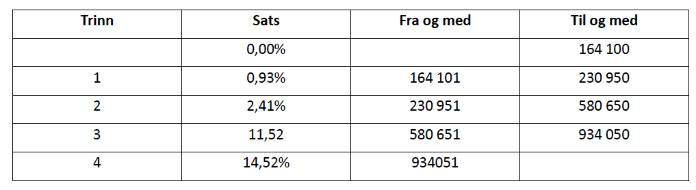

# DAT100: Java Programmering 2 - uke 35

### Oppgave 1 - Vekslepenger

Skriv et program som leser inn en pris og et beløp (begge heltall) som er betalt og beregner hvor mange 10 og 1-kr kunden skal ha igjen i vekslepenger slik kunden får færrest mulig antall mønter tilbake.

**Hint:** Operatoren `%` (modulo) gir rest ved heltalldivisjon.

### Oppgave 2 - Kulevolum

#### a)
Skriv program som beregner volum av en kule ved bruk av Math-biblioteket:

https://docs.oracle.com/en/java/javase/14/docs/api/java.base/java/lang/Math.html

Konstanten `PI` i Math-biblioteket gir tilnærmet verdi for 𝜋


#### b)

Eksemplene i Java-boken bruker *statisk* import av klasser fra de biblioteker som brukes i programmet. Eksempelvis vil vi da bruke:

```java
import static java.lang.Math.*;
```

i programmet for beregning av kulevolum for å få tilgang til konstanter og metoder i Math-bibliotekklassen.

Statisk import betyr at vi kan referere direkte til metoder og konstanter i klassen uten å legge klasse-navnet foran. Eks. kan vi med statisk import skrive:

```java
pow(x,y);
```

istedet for:

```java
Math.pow(x,y);
```

Statisk import er ikke anbefalt for større programmer da vi let kan få sammenfald i navne om der eks. er metoder med samme navn i flere av de biblioteker som importeres.

Skriv om programmet for beregning av kule-volum slik det ikke bruker statisk import dvs. modifiser import-setningene slik de ikke bruke `static`. Eksempelvis skal import-setning for Math-biblioteket endres til:

```java
import java.lang.Math.*;
```

### Oppgave 3 - Valgsetninger

Lag et program som leser inn to tall a og b, og skriver ut verdien av a/b hvis ikke b er 0, og en feilmelding ellers (siden det ikke går an å dele med 0).

### Oppgave 4 - Valgsetninger

Se på koden for inntasting av brukernavn og passord via dialogvinduer:

https://github.com/dat100hib/dat100public/blob/master/undervisning/U02SetningerUttrykk/src/no/hvl/dat100/Login.java

Legg till to String variable som innholder korrekt brukernavne og passord. Bruk en if-setning til å sjekke om der er gitt korrekt login informasjon. For en tekststreng (String) `s1` kan `s1.equals(s2)` (se https://docs.oracle.com/en/java/javase/14/docs/api/java.base/java/lang/String.html) brukes til å sjekke om to strenger er lik (se etter equals metoden på siden).

I praksis vil en aldrig legge inn brukernavn og passord i selve programmet da det utgjør en sikkerhetsrisiko - men vi gjør det slik inntil vi har lært mer om programmering.

### Oppgave 5 - Valgsetninger

Du skal lage et program som leser inn tre heltall fra brukeren, og skriver ut igjen tallene sortert i stigende rekkefølge.

1. Løs oppgaven ved bare å bruke if-setninger.

2. Løs oppgaven ved å bruke if-else-setninger.

### <a name="jp26"></a> Oppgave 6 - del av obligatoriske innlevering 2

En trinnskatt (tidligere toppskatt) er en progressiv skatt på brutto lønn som beregnes når inntekten er
høyere enn 164 100kr.



Se https://www.skatteetaten.no/satser/trinnskatt/?year=2020#rateShowYear for aktuelle satser.

Lag et program som leser inn bruttoinntekt, beregner og skriver ut trinnskatten.

### <a name="jp27"></a> Oppgave 7 - del av obligatoriske innlevering 2

#### a)

Lag et program som leser inn en poengsum (heltall) som en student har oppnådd på en prøve, og finn
og skriv ut den karakteren A-F dette tilsvarer. Grenser for de ulike karakterene skal være:


Skriv ut feilmelding ved ugyldig poengsum (negativ verdi eller over 100).

#### b)

Utvid programmet i pkt. a) slik at det kan lese inn poengsummer fra 10 studenter og skrive ut karakteren
(eller feilmelding) etter hver innlesing. **HINT:** hvordan kan du bruke en for-løkke til dette.

#### c)

Legg inn kontroll på innlesinga i programmet i pkt. b) slik at ugyldige poengsummer (negativ verdi eller over 100) må leses inn på nytt.
