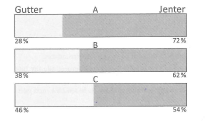

# DAT100: Java Programmering 4 - uke 37

Denne uken er det **obligatorisk skoleprøve for alle tirsdag 14.15 - 16.00** (se informasjon på Canvas). Der er derfor få lab programmeringsoppgaver - men det kan være lurt å bruke programmeringslab denne uken på eventuelle tidligere programmeringsoppgaver som dere ikke er kommet i mål med.

### Oppgave 1 - Debugging

Som beskrevet i læreboken innebærer «Debugging» - eller feilfjerning – å kjøre et program steg for steg for å finne og fjerne feil. Utviklingsverktøy som Eclipse støtter dette og gjør det mulig bla. å inspisere tilstanden av programmet dvs. verdier av variable underveis.

I tillegg til feilfinning og feilfjerning kan stegvis utførsel også være nyttig for å forstå hvordan de ulike konstruksjoner i Java fungerer (semantikken).

#### a)

Les først og gjør stegene:

https://github.com/dat100hib/dat100public/blob/master/eclipse/debugging.md

som gir en introduksjon til debugging i Eclipse.

#### b)

Se på JAVA programmet nedenfor som har til oppgave å beregne volum av en boks utefra høyde, bredde og dybde.

Legg programmet inn i et Eclipse prosjekt og test ved å kjøre programmet om det gir riktig resultat. Prøv eks. med høyde 2, bredde 4 og dybde 8. Forventet resultat er 2 * 4 * 8 = 64.

Bruk debugging som beskrevet i oppgave a) ovenfor til å finne og rette feilen.

```java
import javax.swing.JOptionPane;

public class BoksVolum {

  public static void main(String[] args) {

    int b, h, d;
    String btext, htext, dtext;

    // les inn høyde, bredde, dybde
    htext = JOptionPane.showInputDialog("Angi høyde:");
    btext = JOptionPane.showInputDialog("Angi bredde:");
    dtext = JOptionPane.showInputDialog("Angi dybde:");

    // konverter fra tekst til heltal

    h = Integer.parseInt(htext);
    b = Integer.parseInt(btext);
    d = Integer.parseInt(htext);

    int volum = b * h * d;

    String respons =
        "Volum [" + htext + "," + btext + "," + dtext + "] = " + volum;

        JOptionPane.showMessageDialog(null, respons);
      }
}
```

### Oppgave 2

**Oppgave 18 Kap. 2 i Java-boken:** Denne oppgaven blir relevant for programmeringsprosjektet som kommer senere i faget.

Lag et program ved bruk av EasyGraphics som presenterer kjønnsfordeling i tre skoleklasser som delte linjediagram:



Andelen av gutter i A-klassen er 28 %, i B-klassen er den 38 % og i C klassen er den 46 %.

Fyll et rektangel som er 28 % av bredden til det grafiske vinduet med grønt og fortsett horisontalt mot høyre med at fyllt et rektangel med resten (72 %) av vindusbredden med rødt. Tegn et svart rektangel rundt de to fargefylte rektanglene. Gjenta slik uttegning for de to gjenstående klasser.

### Oppgave 3

#### a)

Hva bli skrevet ut når metodekallet main-metoden nedenfor blir utført?

```java
public static void main(String[] args) {

	int i = 5;
	int j = 10;
	String s = "dat100";
	boolean b = true;

	System.out.println(i * j + i);
	System.out.println(b && i > 5);
	System.out.println(!b || j == 10);
	System.out.println(s.substring(3, 5));
}
```

##### b)

Hva bli skrevet ut når metodekallet main-metoden nedenfor blir utført?

```java

public static void main(String[] args) {

	System.out.println(5 + 3 * 2);
	System.out.println(9 % 5);
	System.out.println(9 / 5);
	int i = 3;
	int j = 7;

	System.out.println( (i < 3) && (j >= 5) );
	System.out.println( (j != 3) || (i < j) );
}
```

##### c)

Hva bli skrevet ut når metodekallet main-metoden nedenfor blir utført?

```java
public static int b(int x, int y) {

	while (x != y) {
		System.out.println("x = " + x + ", y = " + y);
		if (x > y) {
			x = x - y;
		} else {
			y = y - x;
		}
	}

	return x;
}

public static void main(String[] args) {
	System.out.println(b(28, 12));
}
```

### Oppgave 4: Lese Java kode - Gruppearbeid

#### a)
Programmet nedenfor inneheld fire deler. Først studerer kvar student programmet nøye for å finne ut kva som blir skrive ut. Deretter diskuterer gruppen kva som blir skrive ut. Til slutt utfører de programmet og ser om de har rett svar.

```java
public class Oppgave5 {

	public static void main(String[] args) {

		System.out.println("Del 1");
		int i = 1;
		while (i < 1) {
			System.out.println("Nr 1, i = " + i);
		}

		System.out.println("Del 2");
		for (int j = 1; j < 8; j = j * 2) {
			System.out.println("Nr 2, j = " + j);
		}

		System.out.println("Del 3");
		String s = "Test";
		for (int k = s.length() - 1; k > 0; k = k - 1) {
			System.out.println("Nr 3, k = " + s.charAt(k));
		}

		System.out.println("Del 4");
		int tall = 7569;
		int hjelp = tall;
		int aS = 0;
		do {
			hjelp = hjelp / 10;
			aS = aS + 1;
		} while (hjelp > 0);

		System.out.println(tall + " <fyll inn> " + aS + " <fyll inn>");
	}
}
```

#### b)

Kva berekning gjer løkka i Del 4? Prøv gjerne med andre tal enn i eksemplet. Fyll inn i print-setningen slik at utskrifta gir meining.
