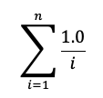
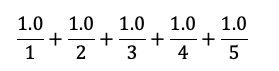

# DAT100: Java Programmering 5 - uke 38

Fra og med denne uken skal vi skifte fra å bruke JDoodle til å bruke IntelliJ. Før du begynner på oppgavene skal du derfor ha følgende installert på egen PC:

- Java Development Kit )JDK): https://github.com/dat100hib/dat100public/blob/master/installasjon/jdk.md
- IntelliJ (Community eller Ultimate Edition): https://github.com/dat100hib/dat100public/blob/master/installasjon/intellij.md 

Se også oppgaver på Canvas om installasjon av JDK og IntelliJ.

Det er anbefalt å du starter med å lage en nytt prosjekt i IntelliJ for oppgavene nedenfor og legger til klasser i prosjektet etterhvert for hver oppgave.

## Grunnleggende oppgaver

Koden i de grunnleggende oppgavene nedenfor skrives inn i klasse `G` med en `main`-metode som vist nedenfor.

```java
public class OppgaveG {

	public static void main(String[] args) {

    // TODO - legg til tabeller og metodekall her

	}

  // TODO - legg til deklarasjon av metoder her

}
```

Som del av oppgaven bør du videre teste at koden og metodene som implementeres fungerer. Dette kan eksempelvis gjøres ved å skrive ut verdien i konsoll-vinduet.

### Oppgave G1: Tabeller

#### a)

Legg inn en tabell med heltal `int[] tabell = {1, 3, 4, 7, 9, 10}` i `main`-metoden.

#### b)

Legg til kode i `main`-metoden som skriver ut innholdet/verdien som står på posisjon `2` i tabellen (riktig svar er 4).

#### c)

Legg til kode i `main`-metoden som endrer innholdet som er lagret på posisjon 2 fra verdien 4 til verdien 7.

#### d)

Legg til kode i `main`-metoden som skriver ut innholdet av tabellen ved bruk av en for-løkke med indeks.

#### e)

Flyt koden fra d) ut i en egen metode `public static void skrivUt(int[] tab) ` som kan skrive ut innholdet av en tabell. Kall `skrivUt`-metoden fra main-metoden.

#### f)

Modifiser metoden fra e) slik den bruker en utvidet for-løkke.

#### g)

Skriv en metode `public static void finnes(int[] tabell, int tall)` som returnerer `true` om `tall` finnes i tabellen og `false` ellers. Bruk en while-løkke.

#### h)

Skriv en metode `public static int[] skiftfortegn (int[] tabell)` som returnerer en ny tabell som er identisk med tabellen gitt med som parameter men frt alle verdier har fått endret fortegn.


### Oppgave G2: Metoder og løkker

Se på programmet nedenfor som leser inn to tall (en høyde og en bredde) og beregner areal via metoden `private static int areal(int bredde, int hoyde)`

```java

public class InputAreal {

	public static void main(String[] args) {

		String breddeStr = showInputDialog("Bredde:");
		int bredde = parseInt(breddeStr);

		String hoydeStr = showInputDialog("Høyde:");
		int hoyde = parseInt(hoydeStr);

		int a = areal(bredde,hoyde);

		showMessageDialog(null,"Areal: " + a);
	}

	private static int areal(int bredde, int hoyde) {

		int flateareal = bredde * hoyde;

		return flateareal;
	}

```

##### a)

Utvid klassen ovenfor med en metode `private static int lesInnTall(String message)` som leser inn et tall via `showInputDialog` og returner heltallverdien. Parameteren `message` er den tekst som skal vises i dialogboksen.

##### b)

Modifiser `main`-metoden i programmet ovenfor slik den bruker metoden fra a) til å lese inn høyde og bredde.

##### c)

Utvid metoden `lesInnTall` fra a) slik metoden fortsetter med å lese inn et tall inntil tallet er positivt. **Hint:** bruk en do-while løkke.

## Basisoppgaver

### Oppgave B1 - Tabeller og decimaltall

Du skal lage et program for å lese inn temperaturen i Bergen for et bestemt klokkeslett for alle dager i en bestemt uke (dvs. 7 temperaturer).

**Temperaturer skal lagres i en tabell**.

Programmet skal videre finne og skrive ut gjennomsnittet av disse verdiene og den høyeste temperaturen for hele uken.

Skjermdialogen kan se ut som eksempelet nedenfor:

```
Analyse av temperaturer
***********************     
Skriv inn temperaturene:
1. dag: 22.2
2. dag: 21.5
3. dag: 26.5
..
7. dag: 18.3

Gjennomsnittstemperaturen var 22.1
Maksimum for denne uken var 26.5 grader
```

### Oppgave B2 - Om tall i Java

Fra matematikken vet vi at tall ikke har en øvre grense og at når vi regner med desimaltall så får vi nøyaktige svar. Det trenger ikke være riktig når vi programmerer. Det er to ting som er *spesielt viktig* å være klar over:

-	Heltall har en øvre og nedre grense.
-	Det har for så vidt også flyttallene (desimaltallene), men det er sjelden et problem.  For disse kan beregninger bli litt unøyaktige.  

I denne oppgaven skal vi se på eksempler på dette.

#### a) 

Koden nedenfor beregner toerpotenser der eksponenten er 0, 1, …, 5.

```java
int n = 5;
int tall = 1;

for (int i = 0; i <= n; i++) {
    System.out.println(tall);
    tall = tall * 2;
}
```

Kjør koden og sjekk at det stemmer. Deretter endrer du `n` til 32 og utfører koden på nytt. Hva skjer på slutten? (Forklaring til slutt i oppgaven)

#### b) 

Fra matematikken vet vi at når vi summerer en rekke med tall, så har det ikke betydning i hvilken rekkefølge vi utfører addisjonene. Det kan det ha når vi programmerer. 

**Eksempel:**

Vi ønsker å finne summen nedenfor.



For `n = 5` blir dette



Dette kan gjøres slik i Java:

```java
int n = 5;
double fraVenstre = 0;
    
for (int i = 1; i <= n; i++) {
    fraVenstre = fraVenstre + (1.0 / i);
}
```

Fra matematikken vet vi at det ikke har betydning i hvilken rekkefølge addisjonene blir utført i. Dvs. vi vil få samme resultatet og vi summerer fra høgre mot venstre som vist nedenfor


Lag en ny løkke som beregner denne summen. Når du sammenligner svarene vil du se at de er litt ulike.

**Det som er viktig for oss:** Når vi regner med flyttall, så kan vi få unøyaktige svar. Det betyr at vi skal være forsiktige å sjekke om to flyttall er like (`==`), men heller sjekke om avstanden er svært liten.
I DAT100 blir ikke dette et problem, men det er viktig å være klar over dette for senere emner.

**Forklaring på hva som skjer i a):** Typen `int` har en øvre grense. På et tidspunkt blir tall større enn grensen. Vi får det som kalles overflyt (overflow). I den aktuelle oppgaven med `n=32`, kan vi unngå problemet ved å bruke typen `long` i stedet for int.  Denne kan inneholde større heltall, men etter hvert som vi dobler tall vil vi få samme problem (igjen). 

### B3 - Debugging

Som beskrevet i læreboken og vist på forelesning innebærer «Debugging» (feilfjerning) å kjøre et program steg for steg for å finne og fjerne feil. Utviklingsverktøy som IntelliJ støtter dette og gjør det mulig bla. å inspisere tilstanden av programmet dvs. verdier av variable underveis.

I tillegg til feilfinning og feilfjerning kan stegvis utførsel også være nyttig for å forstå hvordan de ulike konstruksjoner i Java fungerer (semantikken).

#### a)

Se på JAVA programmet nedenfor som har til oppgave å beregne volum av en boks utefra høyde, bredde og dybde.

Legg programmet inn i et IntelliJ prosjekt.

```java
import javax.swing.JOptionPane;

public class BoksVolum {

  public static void main(String[] args) {

    int b, h, d;
    String btext, htext, dtext;

    // les inn høyde, bredde, dybde
    htext = JOptionPane.showInputDialog("Angi høyde:");
    btext = JOptionPane.showInputDialog("Angi bredde:");
    dtext = JOptionPane.showInputDialog("Angi dybde:");

    // konverter fra tekst til heltal

    h = Integer.parseInt(htext);
    b = Integer.parseInt(btext);
    d = Integer.parseInt(htext);

    int volum = b * h * d;

    String respons =
        "Volum [" + htext + "," + btext + "," + dtext + "] = " + volum;

        JOptionPane.showMessageDialog(null, respons);
      }
}
```

#### b)

Test programmet ved å kjøre programmet på vanlig måte via `Run`. Prøv eks. med høyde 2, bredde 4 og dybde 8. Forventet resultat er 2 * 4 * 8 = 64.

#### c)

For å kjøre programmet stegvis bruker vi «Run» etterfulgt av «Debug» i IntelliJ. Om vi ikke har satt noen pausepunkter (breakpoints) da vil IntelliJ kjøre programmet som vanlig.

1. For å sette et pausepunkt kan vi klikke på linjenummeret der vi ønsker å sette et pause-punkt. Sett et breakpoint i linjen der høyden leses inn. IntelliJ indikerer et breakpoint med en rød sirkel.

2. Velg nå Run etterfulgt av «Debug». Programmet er midlertidig stanset ved første pausepunkt.

3. Gå til knapp-ikonene i nederste vindue og finn ut hvilken funksjon de representerer.
4. Bruk nå *Step Over* til å gå stegvis frem i programmet og se på hvordan verdien av variablene endres underveis.
5. Eksperimenter med bruk av *Resume* og prøv å sette flere pausepunkter i programmet. Hva skjer? - og hvorfor?
6. Et breakpoint kan fjernes ved å høyreklikke på linjen og fravelge *Enabled*. 

Bruk debugging som beskrevet ovenfor til å finne og rette feilen i programmet fra a).

## Valgfrie oppgaver

### Oppgave V1: Repetisjonsløkke og matematiske funksjoner

Ved å bruke `Math`-klassen får du tilgang til matematiske funksjoner som sinus og cosinus ved å bruke `Math.sin(x)` og `Math.cos(x)` i koden. Når du f.eks. skal regne ut verdien `y = sin(x)`, må *x* være i *radianer*.

Omregning mellom grader og radianer gjør du ved formelen:

vinkel i radianer = (π * vinkel i grader) / 180

Verdien π finst i Math-klassen som konstanten `Math.PI`.

Alternativ kan du bruke en innebygd metode i Math-klassen for dette. Se dokumentasjonen for Math-klassen (https://docs.oracle.com/en/java/javase/24/docs/api/index.html) for å finne metoden for omregning mellom grader og radianer.

Lag en enkel klasse der du i main-metoden skriver ut en tabell over sinus og cosinus til alle vinkler mellom 0 og 180 grader, i steg på 15 grader.

Utskriften kan f. eks. se slik ut:

```
  x i grader  x i radianer    sin(x)    cos(x)
------------------------------------------------
           0         0.000     0.000     1.000
          15         0.262     0.259     0.966

          ..            ..        ..        ..

         180         3.142     0.000    -1.000
------------------------------------------------
```

Prøv å løse oppgaven både ved å bruke en for-løkke og etterfølgende ved å bruke en while-løkke.