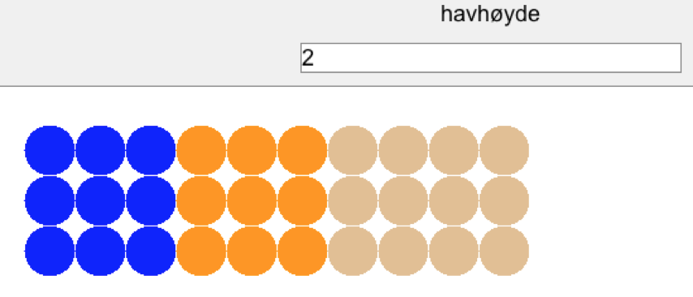
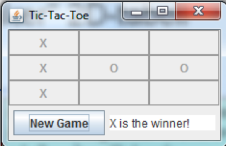

## DAT100: Java Programmering 6 - uke 39

Husk at oppgave 3 på denne programmeringslab er del av obligatorisk innlevering (se Canvas). Husk å bruke startkoden og enhetstester for oppgaven: https://github.com/dat100hib/dat100-javainnlevering2

### Oppgave 1 - Auditorie

Se på eksemplet som blev gjennomgått på forelesningen om flerdimensjonale tabeller der en to-dimensjonal tabell blev brukt til å representere ledige plasser i et auditorie:

https://github.com/dat100hib/dat100public/blob/master/undervisning/U10FlerDimTabeller/src/no/hvl/dat100/eksempler/Auditorium.java

##### a)

Skriv kode som teller sammen hvor mange ledige plasser som er i auditoriet

##### b)

Skriv kode som finner og skriver ut hvor stor en prosentdel av plassene som er opptatt. Metoden skal virke generelt uavhengig av antall rad og antall plasser på hver rad

##### c)

Skriv kode som finner og skriver første ledige plass (rad og posisjon). Prøv å skrive kode som begynner på rad/rekke 0 og kode som begynner på siste rad.

##### d)

Skriv en metode bruker en dobbel for-løkke med `return` til å finne ut om der finnes en ledig plass. Skriv om til å bruke en dobbel utvidet for-løkke med `return`

##### e)

Skriv kode som sjekker om der er minimum to ledige plasser mellom personer i auditoriet (smittevern)

### Oppgave 2 - Oversvømmelse

Høyde i et terreng kan representeres som en 2-dimensjonal tabell (eks. 3x10 felter)

```java
int[][] terreng = { { 0, 0, 0, 3, 3, 3, 6, 7, 8, 10 },
                    { 0, 0, 0, 3, 3, 3, 6, 7, 8, 10 },
                    { 0, 0, 0, 3, 3, 3, 6, 7, 8, 10 } };
```

Prosjektet U10FlerDimTabeller https://github.com/dat100hib/dat100public/tree/master/undervisning/U10FlerDimTabeller i oppbevaringsplassen med eksempler fra undervisning inneholder en pakke `eksempler`.

I pakken finnes en klasse [Flooding.java](https://github.com/dat100hib/dat100public/blob/master/undervisning/U10FlerDimTabeller/src/no/hvl/dat100/flooding/Flooding.java som inneholder starten på et program som kan visualisere konsekvens av en øking av hav-høyden. Hav-høyde leses inn via dialog-boks. Dette blev introdusert på forelesning.



Implementer ferdig metoden `visualiser()` slik at felter i området/tabellen `terreng` som kommer under havets overflate tegnes med en blå sirkel, felter som er mindre en 1 meter over havet tegnes med en oransje sirkel og de felter som er mer en 1 meter over havets overflate tegnes med en lysebrun sirkel. Sirkler tegnes ved å bruke easygraphics.

Det er kun hav-høyde som skal leses inn fra brukeren, terreng er bestemt av den to-dimensjonaletabellen som allerede finnes i programmet.

### Oppgave 3 - Matriser (del av obligatorisk innlevering)

Les beskrivelsen av matriser i oppgave 5.17 i java-boken.

##### a)

Implementer en metode:

```java
public static void skrivUtv1(int[][] matrise)
```

som kan skrive ut en matrise. Prøv å bruk to to (nøstede) utvidede for-løkker (se avsnitt 5.6 i boken for beskrivelse av utvidet for-løkke).

##### b)

Implementer en metode

```java
public static String tilStreng(int[][] matrise)
```

som returnerer en streng-representation av en matrise. Om matrisen er følgende:

```
{ {1,2,3}, {4,5,6}, {7,8,9} }
```

da skal strengen som returneres ha følgende innhold:

```
1 2 3 \n4 5 6 \n7 8 9 \n
```

##### c)

Implementer en metode

```java
public static int[][] skaler(int tall, int[][] matrise)
```
som returnerer en ny matrise der alle tall i matrisen er multiplisert med parameteren `tall`. Metoden må først opprette en matrise like stor som parameteren og så multiplisere alle elementer med `tall`.

##### d)

Implementer en metode

```
public static boolean erLik(int[][] mat1, int[][] mat2)
```

som avgjør om to matriser gitt ved parametrene `a` og `b` er like.

##### e) (Valgfri/vanskelig)

Implementer en metode

```java
public static int[][] speile(int [][] matrise)
```

som kan speile en kvadratisk matrise som beskrevet i oppgave 5.17 i Java-boken. Metoden må først opprette en matrise like stor som parameteren. Etter dette skal metoden kopiere alle elementene fra parameteren til den nye matrisen og så speile den nye

##### f)	(Valgfri/vanskelig)

Implementer en metode

```java
public static int[][] multipliser(int[][] a, int[][] b)
```

som kan multiplisere to matriser. Test metoden. Vi har lov å multiplisere to matriser hvis antall kolonner i den første matrisen er lik antall rekker i den andre.

### Oppgave 4 - Bondesjakk

Prosjektet F13FlerDimTabeller https://github.com/dat100hib/dat100public/tree/master/undervisning/U10FlerDimTabeller i oppbevaringsplassen med eksempler fra forelesninger inneholder en pakke `no.hvl.dat100.tictactoe` som implementerer det meste av koden for et bondesjakk spill. Dette ble demonstrert på forelesning.



For å avgjøre om en spiller har vunnet spillet trenger programmet følgende følgende tre metoder i klassen [GameController.java](https://github.com/dat100hib/dat100public/blob/master/undervisning/U10FlerDimTabeller/src/no/hvl/dat100/tictactoe/GameController.java)

```java
private boolean checkHorizontal(int y, char player)

private boolean checkVertical(int x, char player)

private boolean checkDiagonals(char player)
```

Metodene skal avgjøre om karakteren gitt ved `player` (enten `´X´`eller `´O´`) finnes på alle posisjoner i en horisontal linje (gitt ved `x`), en vertikal linje (gitt ved `y`) eller på en av de to diagonaler.

Disse metoder vil (automatisk) bli kaldt av resten av programmet hver gang en spiller har gjort et trekk. Dvs. dere trenger kun å se på disse tre metodene og ikke resten av programmet.

Den aktuelle tilstand av brettet finnes i den to-dimensjonale tabellen board definert som

```java
char[][] board = new char[TicTacToe.SIZE][TicTacToe.SIZE];
```

der `TicTacToe.SIZE` angir størrelsen på brettet (i figuren ovenfor er den 3).

##### a)

Implementer de tre metoder ovenfor og test spillet. Det går fint an å implementer metodene en om gangen og teste de ved å starte spillet etter hvert. Main-metoden for programmet finnes i klassen [TicTacToe.java](https://github.com/dat100hib/dat100public/blob/master/undervisning/U10FlerDimTabeller/src/no/hvl/dat100/tictactoe/TicTacToe.java).

##### b)

Prøv å endre på verdien av `SIZE` i klassen [TicTacToe.java](https://github.com/dat100hib/dat100public/blob/master/undervisning/U10FlerDimTabeller/src/no/hvl/dat100/tictactoe/TicTacToe.java). Virker spillet fortsatt korrekt?
